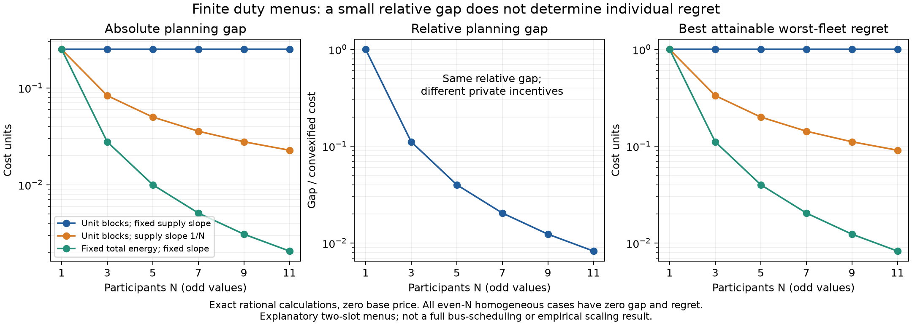

# Exact aggregation and price-support examples — 21 September 2026

An exhaustive rational experiment verifies that a small **relative** planning
gap need not imply a small absolute incentive to deviate. It also separates
joint feasibility from independent responses when a charger resource is shared.
These are explanatory consequences of classical convexification and pricing,
not a new general theorem or an operational bus-fleet performance claim.

## Scope and reproducibility

The [protocol](TWO_SLOT_AGGREGATION_PROTOCOL_20260921.md) and core experiment
were committed before execution at
`7e139b32f8ae762482e33b688f75092e1a2afdf2`, based on main `7e18463`.
The [result](../result/two_slot_aggregation/20260921/exact_results.json)
contains 36 homogeneous and 54 heterogeneous deterministic cases, plus one
shared-capacity witness. It used exact `fractions.Fraction` arithmetic,
Python 3.9.6 and one local process; the recorded elapsed time is 6.78 seconds.
This is not a solver benchmark. No experimental seeds, cluster jobs or protected
data were used. The frozen result SHA-256 is
`540525dbba02d507b407cf69e823a0286237b6e6e2e9349372145a5343747960`.

To reproduce, choose a new output path; existing files cannot be overwritten:

```sh
python -I -S -B src/experiments/two_slot_aggregation.py --output /tmp/egg-two-slot-new.json
python src/experiments/plot_two_slot_aggregation.py /tmp/egg-two-slot-new.json --output /tmp/egg-two-slot-scaling
python -m pytest src/tests/test_two_slot_aggregation.py -q
```

Fresh outputs record their execution time, interpreter and current commit, so
those metadata fields and the whole-file digest can differ while every
scientific field agrees. Plotting requires matplotlib; the core uses only the
standard library. The source commit field is provenance, not cryptographic
attestation of the execution environment.

## What changes with scale

Each participant must place energy e in one of two slots. Intrinsic costs and
linear supply offsets are zero in the homogeneous family, and supply cost is
F(L)=b||L||²/2. Let Δ=z_D−z_CH. Own-price regret evaluates a participant's
alternative at the posted gradient price of the original physical profile;
it does not recompute price after a deviation.

For even N, balance is physically possible and all three reported minima are
zero. For odd N, exact enumeration agrees with the independent formulas
z_CH=bN²e²/4, Δ=be²/4, minimum largest individual regret=be², and minimum
total regret=be²(N+1)/2. All three scale conventions have Δ/z_CH=1/N²:

| Odd-N family | Absolute Δ | Minimum largest individual regret | Minimum total regret |
|---|---:|---:|---:|
| e=1, b=1 | 1/4 | 1 | (N+1)/2 |
| e=1, b=1/N | 1/(4N) | 1/N | (N+1)/(2N) |
| e=1/N, b=1 | 1/(4N²) | 1/N² | (N+1)/(2N²) |



Thus enlarging the fleet, flattening the supply curve and shrinking indivisible
blocks are different treatments. None is merely relabeling owners. Grouping
independent menus while retaining their full Cartesian product leaves the
physical and convexified system costs and summed fixed-price regret unchanged;
the largest **per-owner** regret can change with the grouping. The implementation
checks individual-versus-joint factorization for every uncoupled profile.

The 54 heterogeneous cases add unequal block sizes, intrinsic costs and price
offsets. Across the full 90-case grid, 55 gaps are positive and 35 are zero.
Those frequencies characterize this declared grid, not a sampled population.
At the convex supporting price, the physical optimum's fleet LOC plus supplier
LOC equals Δ in every case; seven cases have positive fleet LOC and 55 have
positive supplier LOC. These settlement terms differ from own-gradient regret.

## Shared capacity changes the response model

Two unit participants share an early-slot capacity of one; a=(0,2), b=1.
The joint physical and convexified optima both cost 3 with load (1,1), so Δ=0.
Energy prices are (1,3). The late participant could save 2 by moving early if
its independent menu ignores the common capacity. That move is infeasible for
the actual joint system. Three distinct statements therefore hold:

- The jointly constrained fleet agent has zero LOC at the energy price.
- Independent unrestricted agents have total LOC 2 at that same energy price.
- Residual-capacity feasible unilateral deviations give both agents zero regret.

An early scarcity price of 2 gives all-in prices (3,3) and supports the chosen
split. It does not ensure feasibility under arbitrary independent tie breaking:
both agents could choose early. The resource rent is 2. If collected separately,
consumer payments are 6, supplier revenue is 4, supplier cost is 3, and the
resource owner receives 2. Zero supplier LOC does not mean zero supplier profit.
No rent rebate, participation compensation, strategic-truthfulness or complete
budget-balanced mechanism is established.

## Verification and limits

Three focused regression tests cover independent odd/even formulas, a nonzero
intrinsic-cost case with an interior convex optimum, and the capacity witness.
Two non-author reviews found no blocking defect. The mathematical reviewer
used a separate implementation with bit-mask enumeration and **all pairwise
convexification segments**, rather than the author's lower-hull algorithm:
30,621 physical profiles, 3,715 segments, all scientific output fields agreeing
exactly. Six deliberately corrupted objective/regret/LOC fields were rejected.
The economic reviewer independently checked all 36 homogeneous rows and the
resource accounting. Review artifacts are indexed in the accompanying manifest.

The examples have two fixed slots and binary energy menus. They omit continuous
charging, routing, SOC trajectories, terminal energy, network effects and
endogenous service demand. Restricting a physical fleet to sampled menus can
raise both physical and convexified costs without ordering their difference.
Consequently these magnitudes and scale rates cannot simply be transferred to
EVSP instances. A continuous-charging qualification with complete structures,
conservative objective bounds and explicit shared-resource deviations is next.

Classical context includes [Bi and Tang's refined Shapley–Folkman analysis](https://arxiv.org/html/1610.05416v3),
[nonconvex demand pricing and LOC](https://arxiv.org/html/1804.00048v1), and
[complete-hull price-support conditions](https://doi.org/10.1007/s00186-022-00775-z).
The contribution of this laboratory is a reproducible separation of metrics
and modeling choices, supporting a more precise future fleet study.
