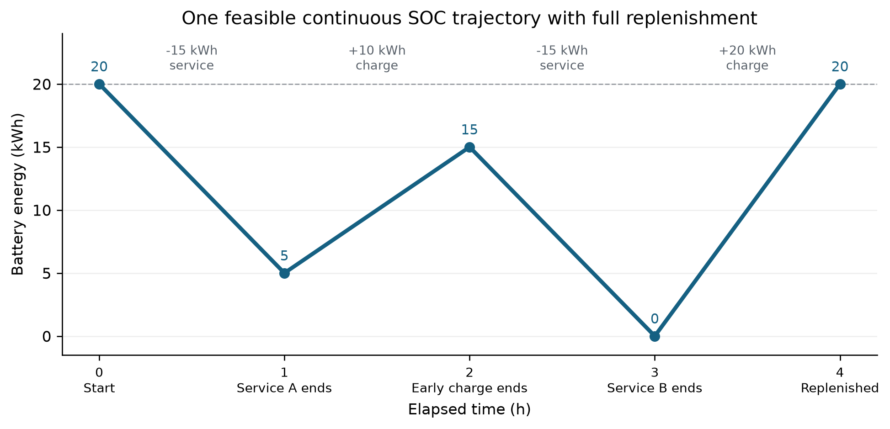
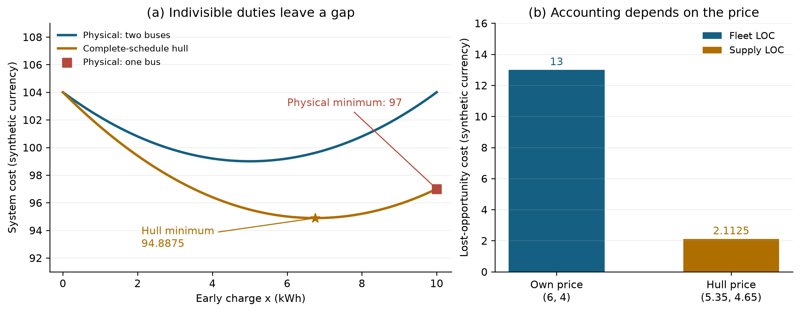
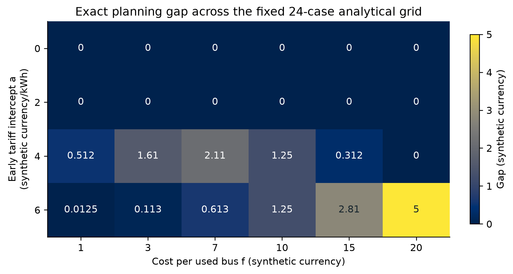
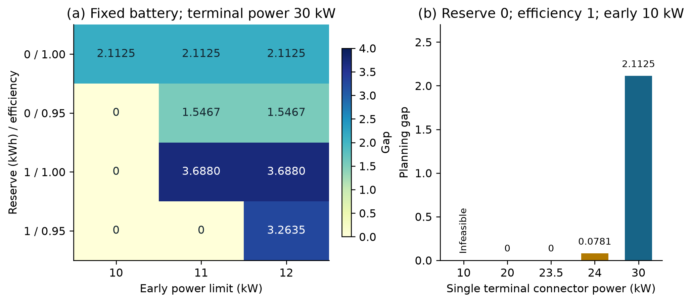
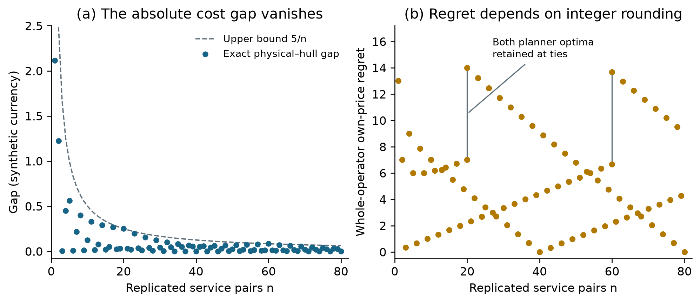
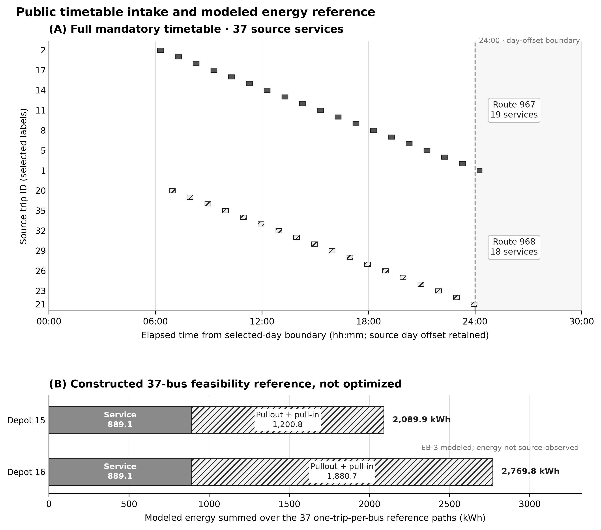
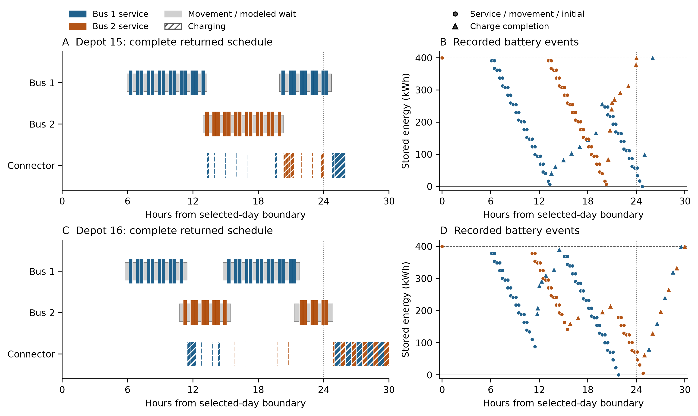

# When marginal electricity prices cannot coordinate electric-bus schedules

## Complete-fleet certificates and a replenished-fleet counterexample

Research draft 0.4 | 27 September 2026 | Working manuscript; nonlinear timetable study pending

### Abstract

Electric-bus charging combines continuous energy decisions with indivisible service assignments. A smooth electricity supply cost therefore need not admit marginal prices that support a physically implementable fleet schedule. We compare physical planning with the convex hull of complete fleet schedules under identical physical and operating-cost assumptions. Classical convexification lower-bounds a schedule's own-price regret; a quadratic upper bound also exposes the role of feasible load flexibility. A fully replenished two-service construction has exact physical and convexified costs of 97 and 94.8875 synthetic currency units. Its own-price fleet regret is 13, while fleet lost opportunity is zero at the common hull price and supplier lost opportunity is 2.1125. A modified construction retains a positive gap with a reserve, 5% charging loss and one finite connector. Scaling demand and supply capacity together makes the absolute planning gap vanish while whole-operator regret can remain positive; per-bus and individually reserved-pair incentives vanish. We give a complete-fleet pricing and mixture certificate procedure and independently audit analytical and numerical controls, including failed attempts. Two full public-timetable scenarios yield feasible two-bus schedules but wide fixed-budget cost bounds. Their flat-price design is a zero-gap control; nonlinear timetable evidence and operational calibration remain open. The results distinguish physical dispatch, mean-load cost, participant rights and incentive normalization.

Keywords: electric-bus scheduling; convex-hull pricing; charging coordination; lost-opportunity cost; column reuse; physical feasibility.

### 1. Introduction

An electric-bus operator must deliver mandatory passenger services while choosing vehicle duties and charging schedules. Even when the amount of electricity charged in each interval is continuous, moving a service between vehicles changes a discrete duty structure. Electricity prices can encourage a different charging pattern or fleet assignment, but the resulting pattern changes the marginal system cost that motivated those prices. This raises a question distinct from finding a low-cost schedule under an exogenous tariff: can a realizable fleet plan be a best response to the marginal electricity prices associated with its own load?

This paper studies that question through complete fleet schedules. A complete schedule contains all mandatory services, their assignment to vehicles, physically feasible charging and the associated intrinsic operating cost. Its convexification permits averages of these complete plans. Such an average is useful for lower bounds and pricing analysis, but need not be a daily dispatch. In particular, evaluating a convex electricity cost at the average load is not the same as averaging the costs of physical daily loads.

The economic principle is established in nonconvex market optimization. Our contribution is a transparent fleet interpretation, fully replenished physical counterexamples with explicit resource and efficiency assumptions, and an exact replication family separating cost-gap convergence from whole-operator incentive convergence. The evidence distinguishes exact arguments, numerical optimization and operational assumptions. We also evaluate simple schedule reuse before proposing a learned acceleration. The paper does not claim a new general welfare theorem, a new principle of convex-hull pricing, or a demonstrated learning improvement.

The distinction is practically relevant for interpreting optimization output. A small convexified objective does not by itself establish an implementable low-cost plan. A small system-cost gap need not imply a similarly small incentive at the realized marginal price. A payment equal to a fleet's lost opportunity does not by itself fund the supply side or define a budget-balanced institution. Each statement requires a specified physical model, price and deviation right.

### 2. Relation to existing work

Electric-vehicle scheduling with charging and electricity-related objectives is a developed field. Wu et al. [1] consider multiple depots, time-of-use prices and peak-load reduction, with branch-and-price and trip-chain reuse. De Vos et al. [2] incorporate partial charging and capacitated charging stations. Parmentier et al. [3] develop scalable route and recharge scheduling through column generation, and ten Bosch et al. [4] combine simulated annealing with integer-programming recombination. These works establish important operational and algorithmic precedents. Our central relaxation uses complete fleet plans, which must be distinguished from a master whose columns are individual vehicle duties. Charging fidelity is also consequential: Löbel et al. [12] analyze how charge-curve approximation can distort energy feasibility and model dynamic power under grid limits. Our constant-efficiency constructions therefore make no claim to cover nonlinear tapering.

Bus aggregation and electricity-market participation are also established. Zoltowska and Lin [5] aggregate bus charging constraints into auction bids and disaggregate accepted plans. Maldonado and Saumweber [6] examine pricing rules with electric-vehicle participants; their empirical comparison concentrates on IP and extended locational marginal pricing. We do not describe that comparison as an empirical exact-convex-hull benchmark.

Madani et al. [7] connect nonconvex bids, dual prices and aggregate lost-opportunity compensation. Andrianesis et al. [8] compute convex-hull prices using Dantzig-Wolfe decomposition over complete participant schedules. Hümbs et al. [9] emphasize the importance of complete participant descriptions for equilibrium interpretation. These are direct antecedents for our certificate perspective. Bichler et al. [10] distinguish stability, individual rationality and financial balance; we retain that distinction when reporting fleet and supply accounting.

For repeated optimization, Sugishita et al. [11] compare learned warm starts with strong initialization and column-prepopulation baselines. That motivates a conservative computational question: after retaining replay-valid physical columns, how much useful work remains before a fresh certificate is obtained? An analytic tariff shift is another inexpensive conceptual baseline, although solving its proposal oracle still has a computational cost. The full source matrix records inspected versions and access limits; this focused review is not an exhaustive novelty census.

### 3. Physical and economic model

Let S be the same nonempty compact set of complete physically feasible schedules in every model. A schedule s has intrinsic operating cost c(s) and charging load L(s), measured in kWh per modeled interval. The load vector and cost are continuous on each discrete duty structure; finitely many structures with bounded charging give a sufficient compactness condition. Mandatory service cannot be discarded to improve the objective.

Let F be a supply-cost function defined on the nonnegative supply domain. Assume that its restriction to that domain is proper, closed and convex, and that it admits a differentiable convex extension to an open neighborhood of the feasible fleet-load hull. These global supply-domain assumptions support the conjugate accounting below; the price-support inequality itself uses only convexity and differentiability near the feasible hull. Define h(s)=c(s)+F(L(s)). The physical planner value is D=min h(s). The complete-schedule convexified value CH minimizes c+F(L) over the convex hull of all physical pairs (c(s),L(s)). The planning gap is Delta=D-CH, which is nonnegative. This hull retains within-fleet resource constraints in every component before mixing.

At a posted price p, the fleet response value is V(p)=min over S of c(s)+p.L(s). At a physical schedule's own price p_s=grad F(L(s)), define r(s)=c(s)+p_s.L(s)-V(p_s). This is price-taking regret: the alternative schedule is evaluated while the posted price stays fixed. It is not a strategic bill comparison in which the operator anticipates the change in price caused by its alternative load.

The single-fleet interpretation is deliberate. If independent operators share chargers, a unilateral deviation must specify whether residual physical capacity is reserved, whether capacity rights are traded, or whether congestion is priced. The convex hull of jointly feasible whole-fleet plans cannot silently substitute for each independent operator's unrestricted opportunity set.

### 4. Price-support and accounting diagnostics

The following fleet specialization uses the classical convexification and duality perspective of [7–9]; it is not a new general pricing theorem.

**Proposition 1.** Under the stated common-model, compactness and convexity assumptions, every physical schedule satisfies r(s) >= h(s)-CH >= D-CH. Moreover, D=CH if and only if a physical schedule is a best response at its own marginal price. When D=CH, every physical planner optimizer has that property.

$$r(s)\geq h(s)-{\rm CH}\geq D-{\rm CH}=\Delta.$$

**Proof.** A linear functional has the same minimum over the physical cost-load set and its convex hull. For any hull point (c_bar,L_bar), its linear private objective is at least V(p_s). The supporting-plane inequality gives F(L_bar) >= F(L(s))+p_s.(L_bar-L(s)). Adding these inequalities and minimizing over the hull yields CH >= h(s)-r(s). If r(s)=0, the chain CH >= h(s) >= D >= CH forces equality. Conversely, a physical planner optimizer is also a hull optimizer when the values agree. The directional derivative of the convex objective toward every physical point is then nonnegative, which is exactly the global best-response inequality at its marginal price.

Attainment is essential to the converse. Equality of infima alone need not produce a physical optimizer. Likewise, support of a best-response correspondence does not prove convergence of an iterative rule that selects one optimizer at every price, or uniqueness of that optimizer.

For numerical work, let [L_D,U_D] and [L_CH,U_CH] be valid objective enclosures. The planning gap lies in [L_D-U_CH,U_D-L_CH].

$$\Delta\in[L_D-U_{\rm CH},\; U_D-L_{\rm CH}].$$

A positive lower endpoint is the relevant nonexistence diagnostic. A restricted pool's replay-feasible mixture can provide U_CH, but its objective is generally not a lower bound for the complete hull. An interval crossing zero leaves the sign unresolved. Numerical enclosures conditional on solver and replay tolerances are not formal exact-arithmetic certificates.

For participant accounting, the supplier may choose any nonnegative load vector, independently of the fleet charging-resource limits. At a common price p for which the conjugate is finite, define the nonnegative-load supply conjugate F*(p)=sup over L>=0 of p.L-F(L). Fleet LOC is c(s)+p.L(s)-V(p), and supply LOC is F(L(s))-p.L(s)+F*(p). Their sum is h(s)-[V(p)-F*(p)]. At a physical planner optimizer and a dual-optimal hull price, under strong duality, this sum equals Delta. At the schedule's own gradient price, supply LOC is zero and fleet LOC equals r(s). These statements condition on different prices. Neither identity proves budget balance, truthfulness, voluntary participation or convergence.

$$\mathrm{LOC}_{\mathrm{fleet}}+\mathrm{LOC}_{\mathrm{supply}}=h(s)-[V(p)-F^*(p)].$$

For quadratic supply, a complementary upper bound explains why feasible load flexibility matters. Write F(L)=a.L+(1/2)L^T B L for symmetric positive semidefinite B, and define the seminorm ||z||_B=(z^T B z)^(1/2). Let R_B be the maximum B-seminorm distance between two physical fleet loads. For any physical schedule, set H=h(s)-CH. Compactness makes this diameter finite and ensures the relevant optima exist. The following consequence uses the same complete opportunity set and holds the own price fixed during a deviation:

$$H\leq r(s)\leq H+R_B\sqrt{2H}.$$

To see the upper bound, let L* be a hull-optimal load, p*=a+B L*, and d=||L(s)-L*||_B. First-order optimality of the hull makes its solution a minimizer of c+p*.L. Expanding the quadratic gives fleet LOC(s;p*)=H-d^2/2>=0, hence d<=sqrt(2H). A best response at the schedule's own price can improve its linear objective relative to p* by at most d R_B, by seminorm Cauchy-Schwarz. Thus r(s)<=H-d^2/2+d R_B, which gives the displayed bound. This argument permits singular B and boundary loads and uses no interior supplier optimum. It is an explanatory consequence of convexity and price-response sensitivity, not a new general market theorem.

The bound also clarifies scale: a small cost gap controls regret together with supply curvature and the range of feasible load changes. For a numerical feasible schedule, a valid lower bound L_CH on the hull value gives the conservative replacement H<=h(s)-L_CH in the increasing displayed expression, provided the load diameter is itself validly bounded. Numerical feasibility and bound qualifications continue to apply.

### 4.1. Computing a complete-fleet certificate

The computational method combines a complete-fleet price-response oracle with a restricted mixture of physical schedules. This is a Dantzig-Wolfe/Fenchel construction in the established sense of [7,8]. The oracle receives a posted vector p and returns a replayed schedule together with an admitted bound q_lower<=V(p). Both physical planning and this oracle use the same mandatory services, allowed movements, battery conditions and shared resources. Appendix A states the compact physical formulation.

For a finite pool of physical columns (c_j,L_j), a nonnegative unit-mass mixture gives c_bar=sum_j lambda_j c_j and L_bar=sum_j lambda_j L_j. Its true objective U=c_bar+F(L_bar) is an upper bound for CH. At any price with finite nonnegative-supply conjugate, the independent lower bound is q_lower-F*(p). These two facts hold even if the restricted mixture is not optimal. A lower bound for the restricted problem alone is insufficient for the complete hull.

The implementation uses separable quadratic supply F(L)=sum_t[a_t L_t+b_t L_t^2/2], with b_t>=0. For b_t>0, a conjugate term is max(p_t-a_t,0)^2/(2b_t); for b_t=0 it is zero when p_t<=a_t and infinite otherwise. This domain check prevents an invalid finite dual bound. The full PSD quadratic result in Section 4 is mathematical; the present computational implementation uses this diagonal subclass.

**Certificate loop.** (1) Start with a fresh price response, or replay every retained whole-fleet column against the identical physical model. (2) Improve the pool mixture using tangent-based linear masters and bounded pairwise refinement of the stored projections. Always evaluate the true quadratic U. (3) Serialize the mixture gradient p and check the restricted Fenchel residual U-[min_j(c_j+p.L_j)-F*(p)]. (4) Request fresh complete-fleet pricing at that same serialized p, update the best global lower bound q_lower-F*(p), and retain the best replay-valid upper value. (5) Certify only if their difference is at most the declared objective tolerance; otherwise append a new physical column and continue within the fixed budgets. A duplicate column, exhausted budget or unadmitted oracle result leaves the question unresolved and retains available evidence.

The restricted residual and pairwise updates are evaluated with exact rational arithmetic on the stored finite column projections and prices. This avoids mistaking repeated numerically identical tangents for progress. It does not convert a floating-point physical witness or solver lower bound into an exact physical certificate. Raw model values, all objective bounds, replay allowances and every attempted oracle/master call are archived. Retention carries physical columns only: weights, prices, tangents and lower bounds are rebuilt for the new economic state.

The physical planner uses the same feasible-set builder with tangent underestimation of F. A native mixed-integer lower bound supplies L_D; evaluating a replayed physical incumbent with the true F supplies U_D. For any returned physical schedule s, fresh pricing at p_s gives a regret enclosure [c(s)+p_s.L(s)-U_V, c(s)+p_s.L(s)-L_V], intersected with nonnegative regret when the enclosures are valid. The public nonlinear comparison must report these physical, hull and regret enclosures together; a time-limited feasible schedule alone is insufficient.

### 5. A fully replenished continuous-charging construction

Two mandatory depot-to-depot services consume 15 kWh each. Service A occurs in hour 0-1 and service B in hour 2-3. At most two identical used buses are available. Each starts and ends with 20 kWh, which is also its battery capacity; the reserve is zero. Charging is continuous and lossless. The early window, hour 1-2, permits 10 kWh in total and 10 kW per bus. The native terminal window, hour 3-4, permits 30 kWh in total and 30 kW per bus. There are enough connectors. No other charging, deadheads, auxiliary load or battery degradation is modeled.

These are explicit synthetic assumptions. The terminal window is part of the physical model, rather than a zero-energy passenger service. An unused bus contributes neither energy nor cost. Every used bus must cover a service. With two unsplittable services there are exactly two unlabeled partitions: one bus serves both, or two buses serve one each.

For one bus, early charge x must satisfy x>=10 to make service B feasible and x<=10 from shared power, so x=10. It charges 20 kWh in the terminal window. For two buses, the bus serving A can charge any x in [0,10] early and 15-x at the end; the bus serving B charges 15 at the end. Every bus finishes at its starting SOC. Both structures therefore purchase exactly 30 kWh. The extra bus cannot donate net initial energy.

Figure 1. One feasible continuously charged one-bus trajectory. The two services each consume 15 kWh; early and terminal charging add 10 and 20 kWh. The line uses constant consumption and charging rates within each one-hour period, consistent with the stated energy model. Initial and final battery energy are equal. This is an explanatory construction, not a measured bus trace.

For this construction, define the global supply function F(e,l)=a*e+0.1*(e^2+l^2) for all nonnegative early and terminal supply quantities e,l. With total fleet recharge 30, its restriction is G(x)=F(x,30-x). For used-bus cost f=7 and early intercept a=4, the one-bus cost is 97. The two-bus branch has cost 14+G(x), minimized at x=5 with value 99. The physical optimum is D=97.

$$D=97,\qquad {\rm CH}=94.8875,\qquad\Delta=\frac{169}{80}=2.1125.$$

Let lambda be the weight on the one-bus structure. The complete projected hull has 0<=lambda<=1, 10lambda<=x<=10 and intrinsic cost 14-7lambda. These conditions are necessary by convex combination. For lambda<1 they are sufficient by assigning the remaining two-bus component early charge (x-10lambda)/(1-lambda). At lambda=1, the constraints force x=10, which is the physical one-bus point. At fixed x the cheapest mixture uses lambda=x/10. The convexified objective is therefore 104-2.7x+0.2x^2, or 7591/80+(x-27/4)^2/5.

$${\rm CH}=\min_{0\leq x\leq10}\left[\frac{7591}{80}+\frac{(x-27/4)^2}{5}\right]=\frac{7591}{80}.$$

Its minimum occurs at x=6.75 and lambda=0.675, giving CH=7591/80=94.8875 and Delta=169/80=2.1125.

A supporting mixture puts weight 27/40 on the one-bus schedule with load (10,20) and weight 13/40 on the two-bus schedule with load (0,30). Both components individually obey the shared limits and full replenishment. The mean load (6.75,23.25) is not assigned a fractional physical fleet in the interpretation. Randomizing those components on different days costs 99.275 on average, rather than 94.8875; Jensen's inequality explains the difference.

Figure 2. (a) Physical branches and the lower-cost boundary of the complete-schedule hull. (b) Fleet and supplier LOC for the same physical planner optimum, evaluated at two different prices. Prices are synthetic currency/kWh and costs are synthetic currency. The physical point and hull minimum are exact rational results. A hull optimizer is a pricing/lower-bound object, not a realizable fractional bus plan.

At the physical optimum, marginal prices are (6,4). Its private objective is 147; two buses charging only in the terminal window have private objective 134. Thus own-price regret is 13. At the hull price (5.35,4.65), both supporting physical components have private objective 153.5. The physical planner's fleet LOC is then zero. Supply LOC is 2.1125, accounting for the whole planning gap. The supply-side calculation uses F*(p)=58.6125, so the common-price dual value is 153.5-58.6125=94.8875.

### 6. Exact parameter checks and evidence quality

The protocol fixed 24 constructed cases before execution: f in {1,3,7,10,15,20} and early intercept a in {0,2,4,6}, holding physics and quadratic coefficient fixed. For each case, the two-bus branch minimizes G(x)=a*x+[x^2+(30-x)^2]/10 on [0,10]; the hull minimizes 2f-f*x/10+G(x). A Fraction-arithmetic driver records both physical schedules and the hull mixture.

An independent implementation reconstructs the same optimization using three physical vertices and quadratic interpolation on the hull edges. It imports no author code and invokes no solver. It checks the full parameter grid, physical coverage, every saved event SOC, individual/shared power limits, exact terminal energy and mixture accounting. All ten deliberate corruptions are rejected. The 24-case grid has 11 positive gaps and 13 exact zeros; these counts describe a fixed analytical design, not a population frequency or a statistical sample.

Figure 3. Gaps on the prospectively fixed analytical grid. Labels are rounded; exact rational values are archived. Fleet cost and early supply intercept vary; service demand, charging windows, shared power and boundary energy stay fixed. Values are synthetic currency. The categorical grid is for mechanism inspection and includes all declared cases, including zeros.

The construction establishes existence under fair boundary-energy accounting. Its operational magnitude remains unknown. The following extensions address reserve, constant charging loss, finite connectors and replication within an exact reference model. Time-dependent travel, nonlinear tapering and operational calibration still require separate qualification; no production-adapter equivalence is inferred from these examples.

### 6.1. Reserve, losses and a finite connector

The nominal point sits on a binding early-power boundary. With the same 20 kWh battery and 10 kW early limit, any positive reserve or efficiency below one removes the one-bus option. When two buses remain feasible, their charging interval is convex and the gap is zero. Adding reserve while also increasing battery capacity by the same amount is an exact SOC translation, but it does not demonstrate robustness at fixed installed capacity.

To examine genuine perturbations, retain battery capacity 20, service energy 15 per trip and the grid-side supply cost F(e,l)=4e+0.1*(e^2+l^2). Let r be the reserve, η the constant grid-to-battery efficiency, P the early power limit and K the power of a single terminal connector. Both windows last one hour. Gross grid purchases total T=30/η for either fleet structure. For 0<=r<=5, define lower early bound l=max(0,T-K), upper bound u=min(P,15/η), and h=max(l,(10+r)/η). The complete two-bus interval is [l,u], and the complete one-bus interval is [h,u]; an interval with lower bound above u is infeasible.

These intervals have explicit connector-feasible realizations. Only A's bus charges early. At the terminal window, use constant aggregate power T-x and serve A's and B's buses consecutively in proportion to their required terminal energy. There is one occupied connector at a time, and every battery finishes full. This assumes zero switching time, constant efficiency and no taper; it is not an assertion about every physical charger.

With r=1, η=19/20, P=12 and K=30, the one-bus optimum buys 220/19 early grid kWh and 20 terminal grid kWh. Its battery trace is 20→5→16→1→20. The early-power slack is 8/19 kWh. The hull mixes that schedule with a two-bus schedule buying 30/19 early and 30 terminal grid kWh, with one-bus weight 453/760. The two terminal sessions occupy 9/19 and 10/19 of an hour. The exact gap is positive:

$$D=\frac{38527}{361},\qquad {\rm CH}=\frac{2987911}{28880},\qquad\Delta=\frac{94249}{28880}\approx3.26347.$$

Strict feasibility and optimization inequalities in Appendix B give an open neighborhood in reserve, efficiency and early power around this modified construction, holding K=30 fixed. This is stronger than a single boundary point, while remaining a synthetic existence result. With vehicle acceptance capped at 30 kW, terminal-resource sensitivity is stated only for K<=30: the original lossless case is infeasible below K=20, has zero gap for 20<=K<=23.5, and has positive gap for 23.5<K<=30.

Figure 4. All 16 prospectively fixed reserve/loss/connector cases: nine positive gaps, six zero gaps and one infeasible case. Panel (a) crosses reserve, efficiency and early power; panel (b) changes terminal power under the nominal remaining assumptions. The nominal 30 kW case appears in both panels and is executed once. Values are synthetic currency, rounded for display; infeasibility has no numerical gap. An independent exact audit checks the complete intervals, all endpoint and supporting schedules, energy conversion, prices and connector sessions under zero switching time; all 22 corruption controls are rejected.

### 6.2. Replication and the scale of incentive error

Replicate the timetable to n simultaneous A services and n simultaneous B services. Keep individual battery and energy requirements fixed, with n early connectors at 10 kW and n terminal connectors at 30 kW. Scale supply cost as F_n(E,L)=4E+(E^2+L^2)/(10n), preserving marginal prices at fixed per-copy demand. This specifies market growth; holding supply curvature fixed would answer a different question.

If m buses each serve A and B, there are n-m A-only and n-m B-only buses, for 2n-m used buses. Complete physical early loads range from 10m to 10n. Every load in this interval has a replenished physical realization: give each paired bus 10 early kWh and share the remainder among A-only buses. Terminal charging can pair each A-only/B-only pair on one connector, with the m paired buses using the remaining connectors. The projected complete hull is a triangle; its lower boundary has intrinsic cost 14n-0.7E.

The hull optimum is CH_n=7591n/80. Every physical optimizer chooses an integer m nearest to 27n/40, with both choices retained at ties. Writing δ=m-27n/40 gives the exact bound

$$\Delta_n=\frac{20\delta^2}{n}\leq\frac{5}{n}.$$

At that physical optimum's own marginal prices, the whole operator can reconsider all service assignments. Along n=40k+1 its regret r_n satisfies

$$\Delta_n=\frac{169}{80n}\longrightarrow0,\qquad r_n=\frac{351}{40}+\frac{169}{40n}\longrightarrow8.775.$$

This incentive belongs to the operator controlling the entire growing fleet. Regret per used bus and regret divided by total physical cost both vanish. There is no positive regret limit over every size: when n is divisible by 40, the physical and hull optima coincide and regret is zero. At n=20, two equally good physical planners have own-price regrets 7 and 14; selecting one silently would conceal a relevant tie.

An explicit alternative institution clarifies the participant interpretation. Give each of n operators one mandatory A/B pair, a reserved early 10 kW connector and a reserved terminal 30 kW connector. Its complete choice is one bus with load (10,20), or two buses with load (x,30-x) for x in [0,10]. These choices are independently feasible under the reserved rights. At the original physical optimum's posted prices p=(4+2m/n,6-2m/n), the one-bus private cost exceeds the best two-bus private cost by 40δ/n. Because m/n>=1/2, the latter uses x=0, with indifference over x at equality. Each participant's current-plan regret is at most 20/n and therefore vanishes. Their summed regret equals the whole-fleet regret in this symmetric family. Along n=40k+1, each dissatisfied one-bus participant has regret 13/n, although the sum approaches 8.775. This post-result derivation has been independently checked against all 88 archived physical optima. It requires the stated partition and reserved resource rights; it is not a conclusion about arbitrary shared-charger games or a counterexample to large-market convexification.

Figure 5. Exact replication results for n=1 through 80, covering two integer-rounding cycles; six larger predeclared sizes are also archived. The absolute planning gap decreases under the proved 5/n envelope, while whole-operator regret depends on rounding and need not converge to zero. Vertical segments connect both planner optima at ties. Costs and regret are synthetic currency. The independent audit reconstructs all 86 cases, 6,448 continuous branch minima and 88 physical optima, including finite-connector schedules and all price accounts; 21 corruption controls are rejected.

The welfare gap is therefore not a substitute for a price-response metric. In this family, every physical planner optimum still has zero fleet LOC at the common hull price, with supply LOC equal to the planning gap. The comparison concerns both which price is posted and how the incentive is normalized.

The quadratic bound makes the same distinction quantitative. Here B=(1/(5n))I and the physical load diameter is R_B=sqrt(40n). At the physical optimum, d^2=2Delta, so the sharper intermediate bound above gives r_n<=40|δ|<=20. Along n=40k+1 it gives r_n<=13, consistently with the exact limit 8.775. Under the reserved-pair interpretation, every assigned pair has zero LOC at the common hull price and diameter sqrt(40/n), recovering its bound 40|δ|/n<=20/n. The increasing whole-fleet load range explains why a vanishing planning gap alone does not force the aggregate incentive bound to vanish.

### 6.3. Qualification of a common native recharge model

A separate native implementation uses the same complete-fleet feasible-set builder for physical planning and price response. Its declared movement graph contains directed, timestamped travel modes and verified depot visits. An elementary interval grid respects every availability and resource boundary; a serial decoder assigns at most one bus at a time to the homogeneous connector. Continuous grid energy, charging efficiency, service and travel consumption, reserve and full terminal replenishment are checked by an independent event replay. This representation assumes zero switching time and no taper, and supports only the explicitly declared directed movement modes.

Independent small-fixture qualification checks physical witnesses and all saved raw rows, rather than trusting a solver status alone. The corrected indexed model passed fifteen controls on both CBC and Gurobi; an exact half-minute timestamp extension passed nineteen, and the compact path-flow version passed twenty. The compact hull integration subsequently certified all eight analytical controls, with independent reconstruction of its pricing, master and refinement calculations. These are declared numerical qualification sets, not arbitrary-instance correctness proofs or runtime comparisons. Appendix C preserves first-attempt failures and later revisions. A post-pilot aggregate energy strengthening remains unqualified after one extraction exception in its twenty-control first attempt; it is not used to revise any reported result.

### 7. Reoptimization before learning

Repeated certified hull and pricing calculations motivate a computational diagnostic: whether previously feasible complete schedules remain useful when only the tariff intercept changes. This is a baseline study, not a second claimed methodological breakthrough. It compares cold initialization, retention of the same arm's previous physical columns, and retention plus one proposal priced at the previous clean price plus the known intercept change. All arms rebuild tangents, duals and objective bounds. Only fresh clean pricing contributes to the lower certificate; proposal calls count even when they produce duplicates.

The earlier two-service qualification contained four tariff states and three arms. Total pricing calls were 12, 6 and 9 for cold, retained and retained-plus-shift. After initialization, the retained arm needed only the mandatory clean verification. This motivated a harder fixed design rather than immediate learner training.

The new design contains three hand-authored three-service fixtures, five tariff states and three arms, for 45 cells. Two fixtures allow one-/two-bus competition and battery depletion, with different vehicle costs. A third fixes two buses using explicit simultaneous terminal markers and restores both batteries; it is an inventory control, not a native overnight adapter or a variable-fleet cyclic example. Each trajectory contains an unchanged state, early-cheap and late-cheap changes, and a return to the initial tariff. All cases use continuous charging and multiple opportunities. They do not include shared-power or plug-count constraints.

The acceptance contract uses a fresh clean restricted master, a complete pricing bound, and a replayed true quadratic upper bound, with objective width at most 0.01. Each pricing solve has a ten-second cap and must return OPTIMAL. The total admission budget is 900 seconds, with one solver thread. After the arms finish, a separate complete-structure formulation supplies 15 reference intervals; those solutions never seed the comparison. The reference shares enumeration utilities and the CBC backend, so it is a formulation cross-check, not independent solver software.

All 45 cells were attempted in the first frozen execution. Forty-four certified cells passed their reference overlap checks, and all 15 references completed. The cold return-to-base cell in the lower vehicle-cost depleted fixture returned FEASIBLE at the pricing time cap and remains failed under the protocol. A narrow pricing bound is not substituted retrospectively for its OPTIMAL gate.

An independent implementation, importing no author code or optimization software, reconstructs all 223 pricing attempts with exact rational inventory-flow dynamic programming. Integral flow supplies and capacities make this exact for these continuous linear pricing problems. Exact Fenchel lower bounds computed from the completed clean prices independently support all 44 successful cells, with objective widths below 0.000913. Physical witnesses are checked at a 0.0000001 kWh tolerance. All 19 corruption controls are rejected. The reference witnesses and complete structure enumeration pass, although their tighter native lower bounds remain conditional solver evidence. This audit is specific to the frozen fixtures, not a certification of the general production adapter.

| Fixture | Cold pricing calls by state | Retained calls | Retained + shift calls |
|---|---|---|---|
| Depleted, f=20 | 7, 7, 5, 6, 7 failed | 7, 1, 2, 3, 1 | 7, 2, 3, 4, 2 |
| Depleted, f=26 | 6, 6, 4, 6, 6 | 6, 1, 1, 2, 1 | 6, 2, 2, 3, 2 |
| Replenished, fixed two buses | 14, 14, 11, 10, 14 | 14, 1, 1, 2, 1 | 14, 2, 2, 3, 2 |

Table 1. Pricing calls include initial seeds, proposals and clean verification. The failed cell includes attempted work and is not a certified time-to-solution observation. States are base, unchanged, early-cheap, late-cheap and return-base, in that order. Dependent states and hand-built fixtures are not independent population samples.

Across all attempts, the arms use 123, 44 and 56 pricing calls and 99.593, 28.062 and 31.881 complete cell seconds, respectively. At the 14 fixture-state keys where all three arms succeed, the corresponding totals are 116, 43 and 54 calls and 78.506, 27.656 and 31.375 seconds. The cold failure contributes seven attempts and 21.088 seconds to the first view. These are single-run descriptive totals, with success conditioning explicit; they do not estimate a general runtime speedup.

Some retained transitions require two or three clean calls, establishing remaining work on this diagnostic. The analytic proposal did not reduce the subsequent clean-call count in these trajectories. Across twelve warm transitions, retention uses 17 pricing calls. An architecture that always adds one full-pricing proposal and still requires one clean pricing verification has a lower limit of 24 calls, even if every proposal is useful. It therefore cannot improve this pricing-call metric on the observed fixed trajectory. Direct learned schedule proposals or selective triggering are different architectures; neither is tested here. The remaining discovery work is not evidence that a learner can remove it. A learning experiment would need a separate frozen development/evaluation design, equal final certificates and full offline/online accounting.

### 8. Operational interpretation and remaining evidence

The intended transportation contribution needs a timetable-based study in addition to exact constructions. That study must identify mandatory trips separately from a provider's solved vehicle blocks; preserve source-row lineage; preserve directed deadheads and state whether travel times depend on departure time; and state vehicle energy, reserve, terminal recharge and charger-resource assumptions. Historical block membership can provide a feasible reference or warm start, but cannot establish a globally optimal schedule or reveal the provider's objective weights.

A local GIRO audit has matched mandatory services to source rows and separated historical vehicle assignments from trip requirements. A proposed 17-service historical pair has observed trip and movement energies, but further inspection found off-depot charging and gaps without explicit movement records. The presence of recorded energies does not establish a complete, source-faithful path. This candidate is not admitted to the depot-only native model, and most counterfactual cross-run movements also lack matching directed records. Battery, replenishment and charger assumptions require explicit declaration. Private source rows, identifiers and hashes remain outside the public artifact.

A public 100-service column-generation benchmark has been pinned and parsed independently. Its energy and time units are abstract, and finite charger capacities and a grid-cost model are not supplied. It can test parser and route feasibility, but does not supply operational calibration for the price-support question. Sistig et al. [13] provide a more directly useful public intake candidate: processed timetables, possible deadheads and heuristic schedules from a twenty-network electrification study, with versioned CC BY data [14]. The smallest complete case has 37 mandatory services and a complete directed deadhead matrix. Its 30-second travel-time offsets are preserved, and energy is reconstructed from declared traction and auxiliary rates rather than treated as telemetry. The two declared one-depot, single-connector variants have passed source and feasibility review; the first flat-price pricing pilot has completed, while the nonlinear planning and hull study remains. They do not reproduce the source two-depot or multi-output charger design. Neither source description nor a published historical schedule establishes an optimal EGG response or an operational economic effect.

An independent source audit reconstructs all 37 services, the directed matrix and every emitted movement mode. A deliberately simple one-service-per-bus construction establishes feasibility of both depot variants under the declared 400 kWh usable inventory, one 360 kW connector and 30-hour replenishment horizon. Its total modeled energy is 2,089.876 kWh for depot 15 and 2,769.814 kWh for depot 16. Each reference includes one modeled pullout and pullin per service; they are feasibility references, not recommended fleets or estimates of optimized consumption.

Figure 6. Public timetable and modeled energy for the complete 37-service Hildenbrand intake, adapted from Sistig et al. [13,14] under CC BY 4.0. (A) Each bar retains the source departure, arrival and next-day offset; rows are services, not assigned vehicles. (B) Service and pullout/pull-in energy for constructed, replay-checked 37-bus references under two separate one-depot scenarios. Both restore full 400 kWh usable inventory by 30:00 using one 360 kW connector. These are not optimized results; energy comes from declared EB-3 assumptions and is not source-observed telemetry.

A flat-price pilot qualifies the timetable response oracle; it cannot test the positive-gap mechanism, because a linear supply objective has the same minimum over any complete physical set and its convex hull (D=CH). A separately frozen pricing pilot retained all 37 services and every declared movement mode in each scenario. It used the compact model, one Gurobi thread, a 180-second native limit per cell, synthetic flat price 0.2 per grid kWh and used-bus cost 100. Both cells returned physically replayed two-bus schedules but reached the limit without proving cost optimality. Table 2 reports every pilot outcome. Its intervals are conditional numerical enclosures, with the frozen 1e-6 objective guard, rather than exact rational physical certificates.

| Single-depot scenario | Native status | Lower bound | Feasible upper bound | Width | Buses | Grid energy, kWh |
|---|---|---:|---:|---:|---:|---:|
|15|FEASIBLE|237.141488|408.533137|171.391649|2|1042.665679|
|16|FEASIBLE|232.146332|433.746086|201.599755|2|1168.730426|

Table 2. Complete public flat-price pilot at synthetic costs. Neither reported interval certifies an optimum; two-bus feasibility does not alone establish a minimum fleet count. The 37-bus references above are deliberately simple feasibility constructions and are not an operational savings baseline.

The independent audit reconstructed 42,297 raw variable values and all model rows, 41 charging sessions and 231 post-initial SOC events, and rejected 16 corrupted evidence variants. The complete local 17-file archive is retained. Public artifacts preserve all 15 scientific files byte-for-byte; two whole stdout files containing institutional solver-licensing details are explicitly omitted with original hashes. One CPU and 8 GB were allocated; the job completed in 6 min 35 s. These fixed-budget outcomes motivate separately versioned bound improvements; they do not retrospectively change this first attempt. An independently audited post-pilot diagnostic relaxes SOC, recharge windows, shared charging and the fleet cap, while retaining full-recharge energy accounting and declared directed movements. A classical minimum-cost assignment construction [15] gives exact stored-input lower bounds of approximately 301.315344 and 305.633808 for the ideal physical problem. Each relaxed optimum uses one path, which does not establish physical feasibility. These rational relaxation bounds are separate from the native matrix/tolerance enclosures in Table 2; they are not combined into a purported exact physical certificate.

Figure 7. Both independently audited first-pilot incumbents, not proven cost optima. Left: all 37 mandatory services per depot assigned to two buses, declared movement or modeled waiting legs in gray, and serial shared-connector sessions hatched in the owning bus color. Right: recorded initial, service, movement and charging-completion battery states; points are event accounting, not interpolated within-leg SOC trajectories. Both start and finish at 400 kWh under the declared full-recharge policy. The dotted 24-hour line preserves the source day offset. Modeled energy is not telemetry; the single-depot, one-connector restrictions and synthetic costs are EGG assumptions.

A timetable alone does not identify the supply curvature. Exogenous time-of-use tariffs, a convex incremental supply cost, contractual demand charges and charger scarcity rents are different economic objects. The first operational sensitivity study should report energy, bus count, physical cost bounds, hull bounds, regret bounds and the stated curvature scale separately. Until calibration is defensible, monetary magnitudes must be labeled stylized.

### 9. Discussion and limitations

The constructions show that continuous charging does not erase duty indivisibility, even when all net service energy is purchased, every used battery is replenished and one finite connector must be scheduled explicitly. The original boundary point is fragile at fixed hardware; a modified point remains positive under reserve and efficiency perturbations. This establishes existence within declared physical assumptions, not prevalence or materiality in real bus systems.

Replication makes the normalization particularly important. Scaling supply capacity with demand yields an absolute planning gap approaching zero, yet whole-operator own-price regret stays positive along a specified subsequence. Per-bus and relative regret vanish, and some fleet sizes have exact price support. When the same services instead belong to bounded pair-level operators with reserved connector rights, every individual's regret also vanishes. Small system-cost gaps, individual incentives and their aggregate must be reported with their respective denominators and ownership assumptions.

The certificate interpretation is strongest when physical models match exactly. An easier duty-level relaxation, a partially enumerated schedule menu or an aggregate-only capacity constraint can answer a different question. For large cases, it may still be possible to certify a positive gap without enumerating the entire hull: a valid physical lower bound and a replay-feasible mixture upper bound suffice. Failure to prove a positive gap is not proof of equilibrium existence.

The numerical reuse study has a different purpose. It is a development diagnostic, with one execution, small fixtures and strict native-solver termination. It does not estimate a runtime distribution or demonstrate learning effectiveness. The failed cold cell illustrates why full work and failures belong in any speed comparison. Future revisions should add an independent solver check and a prospectively chosen larger design only when they answer a concrete scientific uncertainty.

Finally, price support is an incentive statement under specified rights, not an implementation mechanism. A convex-hull price may support fleet behavior while leaving supplier LOC. Charging-resource scarcity may require a separate allocation or rent account. Neither can be resolved by relabeling fleet regret as a universally sufficient subsidy.

### 10. Conclusion

Complete fleet schedules provide the appropriate object for distinguishing physically implementable bus operations from convexified charging plans. Fully replenished continuous-charging constructions have exact positive planning gaps under explicit reserve, loss and connector assumptions, with different lost-opportunity accounts at own and common hull prices. Replication separates convergence of planning cost from convergence of whole-operator incentives. Reoptimization experiments show that retained schedules are a necessary baseline and that additional proposal work must justify its cost under a fresh certificate. The next empirical task is to determine the magnitude and relevance of these effects on a provenance-qualified timetable while retaining explicit energy and resource assumptions.

### Reproducibility and draft status

Every experiment has a prospective source/protocol freeze, an immutable raw archive and a separate independent review. Figure scripts read archived results, and manifests identify the exact inputs and generated outputs. The source-checked literature matrix records access limits. Exact constructions, solver-dependent optimization and post-result analyses are identified separately below. First-attempt failures remain visible; no later repair replaces an earlier outcome.

| Question | Evidence type and scope | Observed result |
|---|---|---|
| Can full replenishment coexist with a positive gap? | Exact rational construction; fixed 24-case design | 11 positive gaps and 13 zeros; nominal gap 169/80 |
| Does the mechanism survive reserve, loss and a finite connector? | Exact 16-case sensitivity and sufficient neighborhood inequalities | 9 positive, 6 zero, 1 infeasible |
| What vanishes with replication? | General derivation and 86 checked sizes, including ties | Gap <=5/n; whole-operator regret can stay positive; reserved-pair regret <=20/n |
| Does retention leave useful discovery work? | One frozen 45-cell diagnostic; all attempts counted | 44 certificates, 1 failure; analytic proposal adds calls |
| Does the common physical/hull implementation pass its controls? | Independently reconstructed numerical fixtures | Corrected 20-control compact and 8-control hull gates pass; later energy-strengthening gate fails 1 of 20 |
| What is known for the full public timetable? | Two fixed-budget flat-price native cells, exact matching diagnostic | Audited two-bus witnesses and wide native intervals; separate ideal relaxation bounds; nonlinear gap and regret remain open |

Table 3. Evidence map. Designed-case counts are not population estimates. Numerical feasibility and global bounds retain their declared tolerances; exact matching arithmetic certifies its relaxation, not a physical schedule. Detailed traces, failed attempts and review manifests accompany the repository.

This remains a working manuscript. The nonlinear public timetable comparison and final scientific/layout review are required before it can support the intended broader transportation claims. The current public prices and operating costs are stylized; neither a market effect nor operational savings has been calibrated.

### Appendix A. Compact complete-fleet physical formulation

The service nodes have fixed times and strictly positive durations. Each declared movement m is a pullout, direct service-to-service connection, connection through a depot visit, or terminal pullin. A movement records its directed travel legs and any available charging window. Chronology makes the service connection graph acyclic. Binary y_m selects a movement. Each mandatory service has exactly one selected incoming and one outgoing movement. The number of pullouts equals the number of pullins and is at most the fleet limit. These constraints decompose the selected graph into complete used-bus paths; an unused bus is neither charged nor counted.

Let u_i and v_i denote battery energy immediately before and after service i, with r<=u_i,v_i<=B and v_i=u_i-E_i. Here B is usable battery capacity, r is reserve and E_i is service energy. Every selected movement enforces the appropriate transition: a pullout sets u_j=B-E_m; a direct connection sets u_j=v_i-E_m. For a depot connection, arrival A=v_i-E_in must satisfy A>=r, the charged inventory A+eta q_m cannot exceed B, and u_j=A+eta q_m-E_out. A terminal pullin has arrival A=v_i-E_m>=r and enforces A+eta q_m=B. Nonnegative energy consumption along each travel leg means the arrival/end checks also bound the intervening leg states. The physical replay checks the individual legs and every service explicitly.

The common elementary time intervals split at all service-independent visit, resource and market boundaries. Variable z_mk is grid kWh charged by visit m in interval k, and q_m=sum_k z_mk. A variable exists only when that visit is available for the entire interval. With common effective power P_k and interval duration d_k hours, 0<=z_mk<=P_k d_k y_m and sum_m z_mk<=P_k d_k. For the homogeneous single-connector model, these aggregate inequalities have a physical serial realization: give each selected visit an interval segment of duration z_mk/P_k, consecutively. Availability is constant on the interval and the summed durations fit. Zero switching time, constant efficiency and no taper are essential to this realization. Zero-power intervals carry no charging.

Market load L_t sums z_mk over the elementary intervals contained in market interval t. Intrinsic cost is the used-bus charge times the pullout count plus the declared travel-cost rate times selected movement duration. The pricing objective is c+p.L; the physical planning objective is c+F(L). Conditional transitions are implemented with big-M rows, but the formulation above describes the intended physical equations. Stored-row rounding, native feasibility tolerances and witness extraction require the separate numerical qualifications and do not follow from ideal integer feasible-set equivalence alone. The public deadhead matrix is time-independent; timestamped movement modes do not represent a calibrated time-dependent traffic model.

### Appendix B. A sufficient open positive-gap neighborhood

Use the Section 6.1 intervals with total recharge T=30/eta and fixed grid-side quadratic cost G_T(x)=a x+[x^2+(T-x)^2]/10. Put k=1/5 and m=T/2-5a/2, so G_T(x)=G_T(m)+k(x-m)^2. Suppose l<m<h<u, f>0 and f<2k(h-l)(h-m); write d=h-l. Both physical branches are nonempty and have strict early-power headroom.

For l<=x<=h, the largest one-bus mixture weight is (x-l)/d, attained by mixing the physical endpoints h and l. Since f>0, the complete hull's lower operating-cost boundary there is 2f-f(x-l)/d. For h<=x<=u it is f. The two-bus physical optimum is m and the one-bus optimum is h. The hull optimum lies between m and h at x_star=m+f/(2kd). Therefore D=G_T(m)+min[f+k(h-m)^2,2f], while CH=G_T(m)+2f-f(m-l)/d-f^2/(4kd^2).

Subtracting gives Delta=min[k(h-x_star)^2, f(m-l)/d+f^2/(4kd^2)]>0. Each inequality is strict. At r=1, eta=19/20, P=12, K=30, f=7 and a=4, the values are l=30/19, m=110/19, h=220/19, u=12 and d=10. The objective threshold is 2kd(h-m)=440/19>7, and u-h=8/19>0. Continuity gives a neighborhood in reserve, efficiency and early power with K=30 fixed and with 0<r<5, 0<eta<1. This sufficient condition does not characterize all positive-gap cases and does not apply to the nominal binding-power point without modification.

### Appendix C. Numerical qualification and failure history

Fifteen predefined controls cover analytical cyclic prices and physical optima, reserve and efficiency, directed multi-leg travel, fractional availability windows, serial connector use and three infeasibility cases. The first frozen CBC implementation passed twelve controls and encountered three witness-extraction or replay exceptions. A separately frozen revision captured every raw native variable before decoding and imposed an explicit whole-incumbent roundoff budget of 1e-8 kWh. It preserves positive charge energy and records any negative-to-zero correction and session-capacity excess. Neither failed artifacts nor unavailable failed incumbents were reconstructed retrospectively.

The corrected revision passed all fifteen controls on CBC and on a separate Gurobi replication with unchanged physical inputs, targets and numerical policy. Each run returned thirty native calls, comprising twenty-seven finite optima and three infeasibilities. Independent solver-free audits reconstructed raw model constraints, every physical witness, all twenty-seven finite fixture objective minima and the expected infeasibilities. All twelve final intervals in each run contained the independently calculated optimum; their approximately 2e-6 widths reflect the declared two-sided numerical guard. Sixteen CBC and eighteen Gurobi corrupted-copy checks were rejected. This is qualification of small declared fixtures, not a proof of arbitrary floating-point oracle correctness or an operational performance comparison. A subsequent source-time extension retained all fifteen inputs and added four half-minute timing controls. All nineteen passed; an independent audit checked every result and rejected twenty-two corruptions. Exogenous timestamps are preserved on an exact half-minute lattice within a declared bounded horizon, while charging remains continuous. A compact formulation removes homogeneous vehicle labels, retaining every mandatory service and movement and recovering complete paths for replay. Its separate twenty-control qualification passed an independent audit of every raw model row and physical witness. Integer feasible-set equivalence does not imply equal LP relaxations or runtime. At that stage, convex-hull machinery and the public timetable remained separate qualification gates.

The exact constructions were frozen at 7bf913a (nominal), ce84e9e (replication) and bd022ac (robustness). Their independent rational auditors import no experiment-author code. The harder reuse source was frozen at 7d3d764. Its audit independently reconstructed all 223 pricing attempts and all 44 successful Fenchel certificates, while retaining the failed cell. The audit also found 145 mutable master-log snapshots. Their solved tangent sets are recoverable from frozen control flow; a prospective deep-copy repair at 78bb4c0 preserves future snapshots without replacing first-run evidence. The independent certificates do not depend on that repair.

The first indexed native-hull attempt certified two controls, exhausted its restricted-master cap on four and blocked two dependent states. Its traces exposed refinement at numerical resolution and useful intermediate mixtures omitted from failed-state summaries. A separately frozen revision added bounded exact arithmetic on stored projections while preserving numerical physical witnesses and native global bounds. All eight controls then certified; independent reconstruction checked 21 global pricing minima, 15 restricted-master LP minima, nine refinement transfers and 31 corrupted copies. The compact-hull integration separately passed the same eight controls with 42 rejected corruptions. No failed state was reclassified. These controls do not establish a public-timetable gap or a general speedup.

After the first public pilot, a separately reviewed aggregate energy band was frozen at 66b7054. Its first twenty-control execution passed nineteen and stopped decoding the joint-loss/reserve planner on a positive charge associated with an unselected movement. Both native calls and their raw incumbents were preserved. This failed qualification blocks downstream use of that revision while its extraction policy is investigated. Later source repairs and evidence must carry new identities and retain this outcome.

### References

[1] Wu, W., Lin, Y., Liu, R., and Jin, W. (2022). The multi-depot electric vehicle scheduling problem with power grid characteristics. Transportation Research Part B 155, 322-347. https://doi.org/10.1016/j.trb.2021.11.007

[2] de Vos, M. H., van Lieshout, R. N., and Dollevoet, T. (2024). Electric vehicle scheduling in public transit with capacitated charging stations. Transportation Science 58(2), 279-294. https://doi.org/10.1287/trsc.2022.0253

[3] Parmentier, A., Martinelli, R., and Vidal, T. (2023). Electric vehicle fleets: Scalable route and recharge scheduling through column generation. Transportation Science 57(3), 631-646. https://doi.org/10.1287/trsc.2023.1199

[4] ten Bosch, W., Hoogeveen, H., van Kooten Niekerk, M., and de Bruin, P. (2026). Scheduling electric vehicles by simulated annealing with recombination through ILP. Public Transport 18(1), 211-228. https://doi.org/10.1007/s12469-026-00424-2

[5] Zoltowska, I., and Lin, J. (2021). Optimal charging schedule planning for electric buses using aggregated day-ahead auction bids. Energies 14(16), 4727. https://doi.org/10.3390/en14164727

[6] Maldonado, F., and Saumweber, A. (2022). Why do pricing rules matter? Electricity market design with electric vehicle participants. World Electric Vehicle Journal 13(8), 143. https://doi.org/10.3390/wevj13080143

[7] Madani, M., Ruiz, C., Siddiqui, S., and Van Vyve, M. (2018). Convex hull, IP and European electricity pricing in a European power exchanges setting with efficient computation of convex hull prices. arXiv:1804.00048v1. https://arxiv.org/abs/1804.00048v1

[8] Andrianesis, P., Bertsimas, D., Caramanis, M. C., and Hogan, W. W. (2022). Computation of convex hull prices in electricity markets with non-convexities using Dantzig-Wolfe decomposition. IEEE Transactions on Power Systems 37(4), 2578-2589. https://doi.org/10.1109/TPWRS.2021.3122000

[9] Hümbs, L., Martin, A., and Schewe, L. (2022). Exploiting complete linear descriptions for decentralized power market problems with integralities. Mathematical Methods of Operations Research 95, 451-474. https://doi.org/10.1007/s00186-022-00775-z

[10] Bichler, M., Knörr, J., and Maldonado, F. (2023). Pricing in nonconvex markets: How to price electricity in the presence of demand response. Information Systems Research 34(2), 652-675. https://doi.org/10.1287/isre.2022.1139

[11] Sugishita, N., Grothey, A., and McKinnon, K. (2024). Use of machine learning models to warmstart column generation for unit commitment. INFORMS Journal on Computing 36(4), 1129-1146. https://doi.org/10.1287/ijoc.2022.0140

[12] Löbel, F., Borndörfer, R., and Weider, S. (2024). Electric bus scheduling with non-linear charging, power grid bottlenecks, and dynamic recharge rates. arXiv:2407.14446v1. https://arxiv.org/abs/2407.14446v1

[13] Sistig, H. M., Sinhuber, P., Rogge, M., and Sauer, D. U. (2025). Evaluating costs and operations of public bus fleet electrification. npj Sustainable Mobility and Transport 2, 15. https://doi.org/10.1038/s44333-025-00030-y

[14] Sistig, H. M., Sinhuber, P., Rogge, M., and Sauer, D. U. (2025). Dataset for evaluating costs and operations of public bus fleet electrification, version 1. Figshare. https://doi.org/10.6084/m9.figshare.26088190.v1

[15] Kuhn, H. W. (1955). The Hungarian method for the assignment problem. Naval Research Logistics Quarterly 2(1–2), 83–97. https://doi.org/10.1002/nav.3800020109
