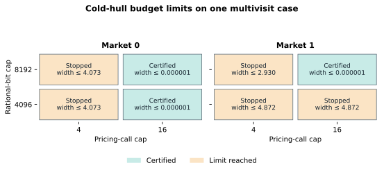

# Cold-hull budget sizing: one multivisit development case

The eight-cell diagnostic completed without a child failure or hard timeout.
On the original market, raising the pricing-call cap from 4 to 16 certified
the native hull enclosure after **five** calls at either rational-bit cap.
On the changed market, 4096 bits stopped exact polishing before a fourth
pricing call, regardless of the call cap; at 8192 bits, four calls still
stopped short, while the 16-call cell certified after **six** calls. Thus the
two limits interact on this case. The result identifies a viable configuration
for a subsequent *development* comparison; it does not establish that 16 calls
or 8192 bits suffice on larger timetables.

| Market | Call cap | Bit cap | Outcome / binding stop | Calls / masters | Max bits | Native hull interval | Width ≤ | Child s |
| --- | ---: | ---: | --- | ---: | ---: | ---: | ---: | ---: |
| Original | 4 | 4096 | Budget: call cap | 4 / 4 | 271 | [80.3961, 84.4682] | 4.072024 | 3.00 |
| Original | 4 | 8192 | Budget: call cap | 4 / 4 | 271 | [80.3961, 84.4682] | 4.072024 | 2.80 |
| Original | 16 | 4096 | Certified | 5 / 4 | 271 | [84.4681, 84.4682] | 0.000001 | 2.90 |
| Original | 16 | 8192 | Certified | 5 / 4 | 271 | [84.4681, 84.4682] | 0.000001 | 2.79 |
| Changed | 4 | 4096 | Budget: projected rational bits | 3 / 3 | 3974 | [81.1732, 86.0446] | 4.871380 | 3.14 |
| Changed | 4 | 8192 | Budget: call cap | 4 / 4 | 7752 | [82.7858, 85.7154] | 2.929458 | 3.54 |
| Changed | 16 | 4096 | Budget: projected rational bits | 3 / 3 | 3974 | [81.1732, 86.0446] | 4.871380 | 2.88 |
| Changed | 16 | 8192 | Certified | 6 / 5 | 7752 | [84.7207, 84.7208] | 0.000001 | 3.70 |

Intervals round the global lower **down** and feasible upper **up** to four
decimals; widths round **up** to six decimals. The unrounded native intervals
are in the sealed `summary.json`; [rows.json](rows.json) preserves SHA-256
hashes of each exact stored-fraction endpoint and the compact
[CSV](rows.csv) gives every component. A certified width is approximately
`1e-6`, within the configured `1e-4` criterion. These are native numerical
enclosures with solver and physical-replay tolerances. Writing their stored
numbers as fractions does not make them exact ideal-model proofs.

The original market consumed at most 271 rational bits, so increasing its bit
cap did not address its observed stop. Its recorded reason was the combined
"pricing/time budget exhausted" guard; four requests and under three seconds
of a 60-second wall allowance identify the call cap as the binding factor.
Under the changed market, the 4096-bit
cells stopped on a *projected* next arithmetic size; the recorded maximum of
3974 bits need not itself exceed the cap. Raising the bit cap to 8192 allowed
7752 recorded bits and a further pricing call under the four-call cap. Only
then did the call limit become visible. The call/bit changes may alter later
price trajectories; this factorial contrast is not a same-price-path
decomposition. Shared master and pool caps of 64, plus the same native-LP
master, compact physical pricing oracle, one-thread GRB backend, 60-second
coordinator wall, 45-second native phase, and other tolerances held fixed
within this new diagnostic. The older frozen comparisons had other caps and
must not be treated as matched timing controls.

All eight child receipts were on time and their assessments had complete
replayed evidence. Child wall times total **24.75 s** (2.79–3.70 s each).
Recorded native pricing solver time totals **0.260 s**; one original-market
four-call cell recorded 0.198 s, versus 0.007–0.011 s in the other seven.
Native restricted-master time totals **0.084 s**, and rational polishing
**2.268 s** (0.035–0.812 s per cell). Each recorded pricing/master component
is complete for its calls, but these components do not cover model creation,
validation, event writing, subprocess startup or all orchestration. They must
not be subtracted from child wall to invent a routing cost. The supervisor
took **27.51 s**; the wrapper records **17 s** of setup and **48 s** of whole
job elapsed on job 591255. [Slurm accounting](sacct.txt) records **51 s**
for the allocation; its scope includes work outside the wrapper's elapsed
counter. Freeze/preflight/supervise exited 0 with stable
source/process sealing. No run-to-run speed comparison follows from one
deterministic seed-0 execution on one three-service timetable.

**Next bounded package.** Before a larger retrieval comparison, run a fresh
six-cell **baseline-viability screen** on the already prepared 8-, 16- and
24-service synthetic development cases, each in two declared markets. Use
cold full-fleet hull only, one-thread GRB, 16 pricing calls, 8192 rational
bits, common 64 master/pool headroom, and a prospective 180 s coordinator
wall/160 s native phase with 210 s hard child cap. Six children fit a 1500 s
controller and 1600 s outer cap in a one-CPU, 8 GB, 30-minute allocation;
no retries or protected test groups. Record complete bound quality, stop
reason, calls, arithmetic growth, component and end-to-end time. Treat this
as configuration selection, not independent evaluation. If it yields usable
source/target bounds, freeze a *new* matched cold/retained/nearest-neighbor
comparison with paid source generation, fresh target pricing and a common
quality target. The old frozen retrieval replacement remains separate.

The [design](../DESIGN.md) and [curation script](analyze.py) specify this
diagnostic's controls and reproducible summary-only derivation. The source
commit was `1dba007ee4868f0d29373a84b7880171ab3c358c`. All eight rows
and their unsuccessful budget outcomes remain in the sealed result.
