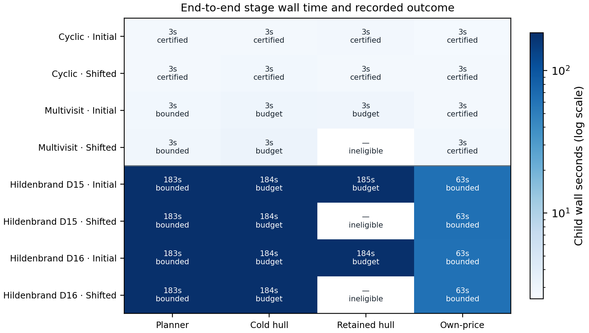
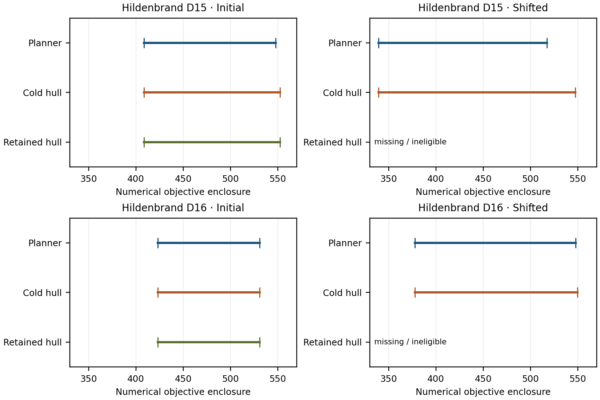

# First computational screen

This development screen identifies where the next solver changes should focus.
Public hull stages spent about 94% of their wall time in native pricing solves.
Their second returned plan was not processed by another master before the budget
ended. A separate calculation using the two saved plans improved the mixture
upper values, but public optimality gaps remain open.

- [All-stage results, comparisons and postprocessing](ANALYSIS.md)
- [Machine-readable analysis and selected timings](analysis.json)
- [Scientific evidence ZIP](scientific_evidence.zip) and [selection manifest](PUBLIC_EVIDENCE_MANIFEST.json)



**Runtime and outcome.** Each row is one physical case and market. “Budget” means
an algorithm work limit was reached, which may be a time, call or arithmetic
limit. All launched stages returned within their separate hard deadlines.
“Certified” means the native numerical target was met. The two Hildenbrand depots
are variants of one base timetable. Each initial cold and retained solve starts
fresh; preparation costs are included in the two-state comparison table.



**Original-run bounds.** Each bar spans the reported lower and upper endpoints;
there is no point estimate. Public hulls stopped with open bounds, and shifted
retained stages were ineligible under the certified-predecessor rule. Axes share
one scale. These are native numerical enclosures, not ideal-model exact proofs.
The postprocessing table is separate and does not overwrite these original-run
values or timings.

## Reproduction and evidence scope

The ZIP preserves 101 original scientific JSON files, including frozen physical
and market inputs, saved fleet columns/witnesses, assessments and receipts. Its
manifest records the included and omitted original hashes. It is an explicitly
selected package, not the full sealed attempt. Full event traces and scheduler
logs remain in the private archive; no license diagnostics are published.

The numerical values and figure inputs are also available in `analysis.json`.
Full trace-derived timing regeneration uses the complete sealed archive and
private collection receipt. With Python 3.12 and the research dependencies, set
`EGG_ATTEMPT` to that extracted attempt, `EGG_COLLECTION` to its collection
receipt, and `EGG_REPORT` and `EGG_ANALYSIS` to new output directories. From the
repository root:

```sh
PYTHONPATH=src python -m experiments.computational_benchmark_report "$EGG_ATTEMPT" "$EGG_REPORT"
PYTHONPATH=src python research-20260928/computational-results/analyze_attempt1.py --report "$EGG_REPORT/report.json" --attempt "$EGG_ATTEMPT" --collection "$EGG_COLLECTION" --out "$EGG_ANALYSIS"
```

The four two-column calculations use a closed-form segment minimum followed by
physical-column and stored-number mixture replay; no new native optimizer or
pricing call is made. Their measured processing time excludes imports, case
construction and report/figure writing. The resulting mixtures are convex-hull
points, not individual executable schedules. Stronger compatible historical
bounds are not superseded.
