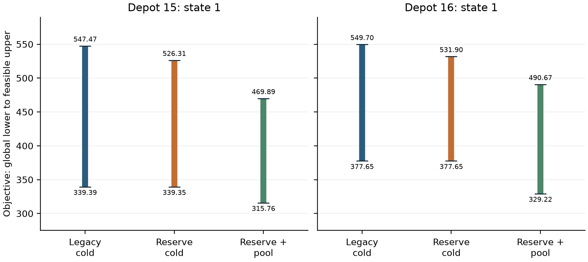
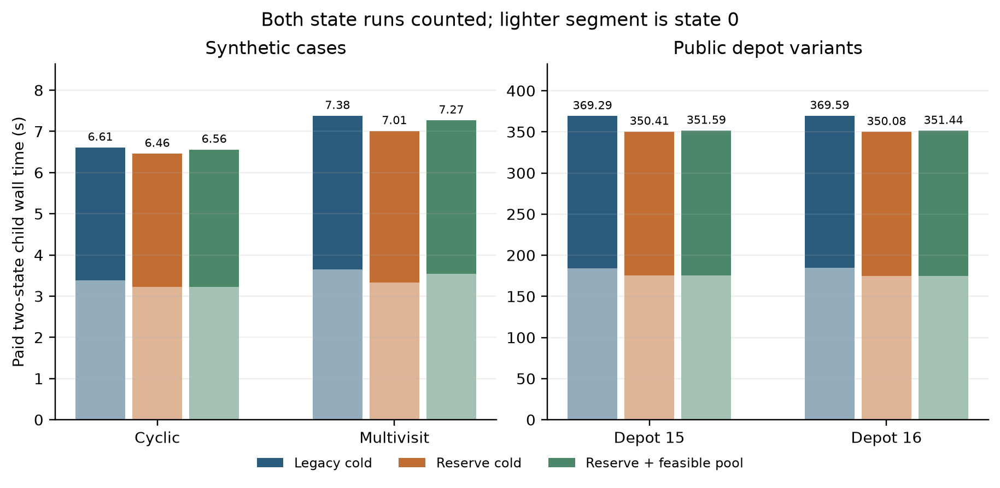

# Reserved finishing time and feasible-plan reuse

The matched pilot completed all 24 calculations: four physical cases, two
markets and three methods. Seven calculations certified their native numerical
enclosures; 17 reached a work limit. Every child returned on time with complete
evidence. The two public depots belong to the same Hildenbrand timetable, and
all cases are development data.

Reserving ten seconds inside the existing pricing budget let every public cold
run process its second fleet plan. Its upper cost bound improved by about
17.80–69.39 units across the four public case–market pairs. Both-market time
was about 350 seconds per public case, versus 369 seconds for legacy cold
solving. These are descriptive final-bound/time comparisons from one run;
no common time-to-quality target or general speedup was established.

Feasible-plan reuse certified the shifted three-service example where both
cold methods reached the rational-polishing limit. On the public cases it
improved the upper cost bounds but weakened the new pricing lower bounds.
The resulting interval narrowed for depot 15 and widened for depot 16. Paid
two-market time was slightly higher than reserved-time cold solving. Reuse
therefore has a useful small-case result and an unresolved public comparison.

Each bar spans a global lower bound and the cost of a feasible convex mixture
of complete fleet plans. A mixture is not a single executable fleet schedule.
Both public reused-pool runs stopped at the rational-polishing bit limit after
adding a current-market plan. Neither public case reached a closed global gap.
Endpoint labels round outward; numerical certification uses unrounded values.

Initial preparation is included for every method. These are child wall times;
whole-job elapsed was 36:49, including setup and controller work. Slurm
allocated two CPUs despite the one-CPU request; the serial runner, native
optimizer and numerical libraries were configured for one thread. Requested
memory was 8 GB. No retry or additional optimization accompanied this analysis.

A separate [saved-pricing-bound calculation](posthoc_oracle_bound/README.md)
identifies a stronger baseline. The physical pricing problem at a fixed posted
price remains unchanged when only the supply-cost function changes. Re-evaluating
its saved bound under the new supply cost narrows the two reused-pool target
gaps to about 64 and 70 cost units, without another routing solve. This posthoc
result is outside the timed pilot and retains the original solver tolerance
qualification. It does not change any recorded status or prove optimality.

The next bounded solver work should add an explicit, checked cache of these
physical pricing bounds before further learning comparisons. The numerical
restricted-master proposal already developed separately is the next remedy
for the rational-polishing stop. Fresh target-market global pricing remains
required for certification, and changed physical instances cannot inherit a
pricing certificate automatically. Broader public cases and retrieval/learning
comparisons follow these baseline corrections.

- [All 24 outcomes, paired comparisons and timing definitions](analysis/README.md)
- [Machine-readable analysis and compact pricing traces](analysis/report.json)
- [Independent scientific review](INDEPENDENT_REVIEW.md)
- [Original scientific evidence ZIP](scientific_evidence.zip) and
  [complete inclusion/omission manifest](PUBLIC_EVIDENCE_MANIFEST.json)
- [Prospective protocol](../../../doc/FEASIBLE_POOL_PILOT_PROTOCOL_20260928.md)
- [Collection receipt](../../cluster/feasible-pool-pilot-572392-collection.json)

The ZIP contains 75 original scientific files. The full private archive also
preserves raw events, diagnostics and scheduler records. The selection manifest
lists every included and omitted original file; the ZIP is a subset, not the
complete sealed attempt. Derived analysis never edits that attempt.

Reproduction commands are in the analysis and posthoc notes. Public evidence
selection is reproducible with `research-20260928/feasible-pool-pilot/package_evidence.py`.
