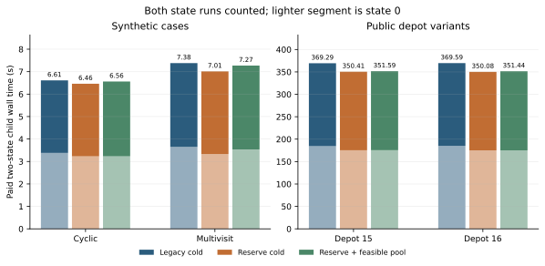
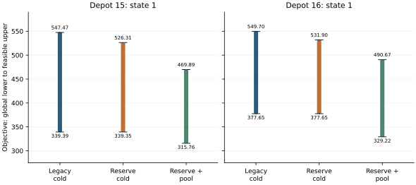

# Feasible-pool pilot: descriptive results

Development-only sealed attempt; manifest SHA-256 `b2f3630f4229792c47f60bc2a1a60645d506fd887feaa2a3e379bd8107628e6a`; source commit `77dee963eb30ba85bca68b3efcf61d099fa33076`.
All 24 cells are accounted for. Supervisor return code 0; source hashes unchanged: True.

The reserve enabled a second master in all four public reserve-cold cells, while the legacy public cells ended before a second master. The reserve stop was recorded in all four reserve-cold public cells.
State-1 feasible-pool reuse closed the global enclosure on the multivisit case. On both public depot variants it improved the feasible upper but weakened the fresh global lower; neither public state-1 reuse cell certified.
The public variants share one base timetable group. One deterministic development run gives paired descriptions, not a general speedup or scalability estimate.

## All declared cells

| Case | State | Method | Outcome | Wall s | Global lower | Feasible upper | Pricing | Master | Polish s | Stop reason |
| --- | ---: | --- | --- | ---: | ---: | ---: | ---: | ---: | ---: | --- |
| synthetic_cyclic | 0 | Legacy cold | certified | 3.38 | 94.88 | 94.89 | 3 | 2 | 0.03 | — |
| synthetic_cyclic | 0 | Reserve cold | certified | 3.23 | 94.88 | 94.89 | 3 | 2 | 0.03 | — |
| synthetic_cyclic | 0 | Reserve + feasible pool | certified | 3.23 | 94.88 | 94.89 | 3 | 2 | 0.02 | — |
| synthetic_cyclic | 1 | Legacy cold | certified | 3.23 | 97.98 | 97.99 | 3 | 2 | 0.03 | — |
| synthetic_cyclic | 1 | Reserve cold | certified | 3.23 | 97.98 | 97.99 | 3 | 2 | 0.02 | — |
| synthetic_cyclic | 1 | Reserve + feasible pool | certified | 3.33 | 97.98 | 97.99 | 1 | 1 | 0.01 | — |
| synthetic_multivisit | 0 | Legacy cold | budget_exhausted | 3.65 | 80.39 | 84.47 | 4 | 4 | 0.06 | pricing/time budget exhausted |
| synthetic_multivisit | 0 | Reserve cold | budget_exhausted | 3.33 | 80.39 | 84.47 | 4 | 4 | 0.05 | pricing call budget exhausted |
| synthetic_multivisit | 0 | Reserve + feasible pool | budget_exhausted | 3.54 | 80.39 | 84.47 | 4 | 4 | 0.06 | pricing call budget exhausted |
| synthetic_multivisit | 1 | Legacy cold | budget_exhausted | 3.73 | 81.17 | 86.05 | 3 | 3 | 0.40 | rational polishing projected bit-size budget exhausted |
| synthetic_multivisit | 1 | Reserve cold | budget_exhausted | 3.68 | 81.17 | 86.05 | 3 | 3 | 0.39 | rational polishing projected bit-size budget exhausted |
| synthetic_multivisit | 1 | Reserve + feasible pool | certified | 3.73 | 84.72 | 84.73 | 1 | 1 | 0.37 | — |
| public_depot15 | 0 | Legacy cold | budget_exhausted | 184.39 | 408.53 | 552.36 | 2 | 1 | 0.01 | master/time budget exhausted |
| public_depot15 | 0 | Reserve cold | budget_exhausted | 175.29 | 408.53 | 482.98 | 2 | 2 | 0.22 | pricing reserve prevented a new request |
| public_depot15 | 0 | Reserve + feasible pool | budget_exhausted | 175.43 | 408.53 | 482.98 | 2 | 2 | 0.22 | pricing reserve prevented a new request |
| public_depot15 | 1 | Legacy cold | budget_exhausted | 184.90 | 339.39 | 547.47 | 2 | 1 | 0.01 | master/time budget exhausted |
| public_depot15 | 1 | Reserve cold | budget_exhausted | 175.12 | 339.35 | 526.31 | 2 | 2 | 0.19 | pricing reserve prevented a new request |
| public_depot15 | 1 | Reserve + feasible pool | budget_exhausted | 176.16 | 315.76 | 469.89 | 1 | 2 | 6.06 | rational polishing projected bit-size budget exhausted |
| public_depot16 | 0 | Legacy cold | budget_exhausted | 184.92 | 423.15 | 530.66 | 2 | 1 | 0.01 | master/time budget exhausted |
| public_depot16 | 0 | Reserve cold | budget_exhausted | 175.02 | 423.15 | 493.28 | 2 | 2 | 0.19 | pricing reserve prevented a new request |
| public_depot16 | 0 | Reserve + feasible pool | budget_exhausted | 174.91 | 423.15 | 493.28 | 2 | 2 | 0.23 | pricing reserve prevented a new request |
| public_depot16 | 1 | Legacy cold | budget_exhausted | 184.66 | 377.65 | 549.70 | 2 | 1 | 0.01 | master/time budget exhausted |
| public_depot16 | 1 | Reserve cold | budget_exhausted | 175.07 | 377.65 | 531.90 | 2 | 2 | 0.22 | pricing reserve prevented a new request |
| public_depot16 | 1 | Reserve + feasible pool | budget_exhausted | 176.53 | 329.22 | 490.67 | 1 | 2 | 5.75 | rational polishing projected bit-size budget exhausted |

## Paid two-state time

Both state receipts are required; state 0 is never free.

| Case | Method | State 0 s | State 1 s | Total s | Outcomes |
| --- | --- | ---: | ---: | ---: | --- |
| synthetic_cyclic | Legacy cold | 3.38 | 3.23 | 6.61 | certified, certified |
| synthetic_cyclic | Reserve cold | 3.23 | 3.23 | 6.46 | certified, certified |
| synthetic_cyclic | Reserve + feasible pool | 3.23 | 3.33 | 6.56 | certified, certified |
| synthetic_multivisit | Legacy cold | 3.65 | 3.73 | 7.38 | budget_exhausted, budget_exhausted |
| synthetic_multivisit | Reserve cold | 3.33 | 3.68 | 7.01 | budget_exhausted, budget_exhausted |
| synthetic_multivisit | Reserve + feasible pool | 3.54 | 3.73 | 7.27 | budget_exhausted, certified |
| public_depot15 | Legacy cold | 184.39 | 184.90 | 369.29 | budget_exhausted, budget_exhausted |
| public_depot15 | Reserve cold | 175.29 | 175.12 | 350.41 | budget_exhausted, budget_exhausted |
| public_depot15 | Reserve + feasible pool | 175.43 | 176.16 | 351.59 | budget_exhausted, budget_exhausted |
| public_depot16 | Legacy cold | 184.92 | 184.66 | 369.59 | budget_exhausted, budget_exhausted |
| public_depot16 | Reserve cold | 175.02 | 175.07 | 350.08 | budget_exhausted, budget_exhausted |
| public_depot16 | Reserve + feasible pool | 174.91 | 176.53 | 351.44 | budget_exhausted, budget_exhausted |

## Reading the bounds and timings

The lower endpoint comes from fresh target-market native pricing; the upper endpoint is a feasible convex mixture of complete fleet plans. The last restricted-pool gap in `cells.csv` concerns only that finite column pool. A mixture is not one executable fleet schedule.
Displayed lower endpoints round down and upper endpoints round up to two decimals. Unrounded values in `cells.csv` and `report.json` determine gaps and certification.
`report.json` retains compact pricing-call native status, incumbent, lower bound, native solver wall time, global-bound lower, candidate key and the sealed events SHA for each cell. It also records master native wall times, added columns reaching later masters, reserve-stop events, and stop reasons. Missing component times stay missing; native solver sums are not end-to-end stage time. Import replay cost has no independent timer in this run.
In public state 1, legacy cold obtained a second priced fleet column but did not reach a second master before the wall stop. Reserve cold reached two masters, with both priced columns processed, then hit the explicit reserve guard. Feasible reuse imported two state-0 columns into its first master, priced one fresh target-market column, processed it in a second master, and then hit the projected rational bit-size limit. Recorded public pricing native wall time dominates (about 160–172 s per state-1 cell); master native solves are below 0.01 s, while feasible-reuse polishing totals about 5.75–6.06 s. These recorded components do not measure import replay separately.
The last completed restricted-pool gap can be zero while the global enclosure remains open: the finite pool excludes unpriced fleet plans. The feasible-pool public upper endpoints improved by 56.43 and 41.24 relative to reserve cold, but its fresh global lower endpoints weakened by 23.59 and 48.43. Thus those cells do not establish tighter global gaps.
The public feasible-pool state-1 stops were projected rational bit-size limits; reserve engagement there was not observed. The reserve-cold public stops were explicit reserve guards. No equal-quality time target was specified, so the time differences are descriptive and no speedup is claimed.

A [separate posthoc oracle-bound diagnostic](../posthoc_oracle_bound/README.md) recomputes target-market lower bounds from same-physical-case state-0 pricing evidence. It is a lead for a prospectively controlled cache baseline; it is not part of these timed arms or a new optimizer solve.

## Reproduction

Run from the repository root with a new output directory and the complete sealed private attempt, including every `events.jsonl` and `MANIFEST.json`. The curated public evidence subset omits files required by the manifest check.

```sh
PYTHONPATH=src python -m experiments.feasible_pool_pilot_report <complete-private-attempt> <new-output-dir>
```




