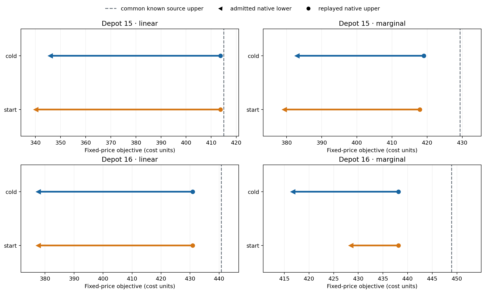
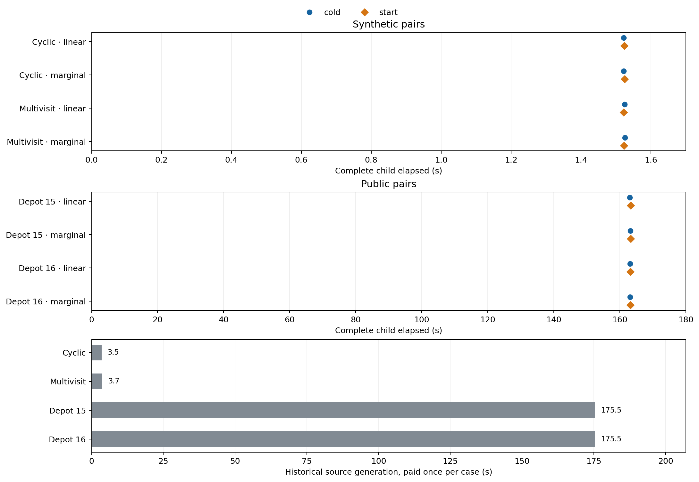

# Fixed-price pricing-start pilot: attempt 1

All 16 declared calls returned. Each of eight starts was submitted to the native API; solver acceptance was not observable. The four synthetic pairs returned the same certified numerical intervals in both arms. All eight public calls consumed the 160 s native cap. Among four public query pairs, the start improved one replayed incumbent (depot 15 marginal) and one admitted lower bound (depot 16 marginal), worsened two lower bounds, and tied the remaining lower bound within 1e-5. This is a mixed quality result at equal caps, not evidence of faster solving.

The cases are development diagnostics. Depot 15 and depot 16 are variants of one Hildenbrand base timetable; they are not independent public replications. Linear and marginal prices were distinct in all four cases. No time to first incumbent was recorded.

## Public native quality at the cap

Every row below has a physically replayed native upper. The source upper is the same known feasible baseline available to both arms. The native lower is the separately admitted lower bound; the solver's raw lower is retained in `calls.csv`. Lower objective/upper is better; higher lower bound is better.

| Case · query | Common source upper | Cold native upper | Start native upper | Cold admitted lower | Start admitted lower | Source excess¹ | Start effect |
|---|---:|---:|---:|---:|---:|---:|---|
| Depot 15 · linear | 414.986 | 413.662 | 413.662 | 345.867 | 340.188 | 0.32% | upper tie within 1e-5; lower start worse |
| Depot 15 · marginal | 429.386 | 419.054 | 417.949 | 383.008 | 379.414 | 2.74% | upper start better; lower start worse |
| Depot 16 · linear | 440.791 | 430.859 | 430.859 | 377.660 | 377.660 | 2.30% | upper tie within 1e-5; lower tie within 1e-5 |
| Depot 16 · marginal | 448.939 | 438.165 | 438.165 | 416.727 | 428.512 | 2.46% | upper tie within 1e-5; lower start better |

¹ `(common source upper − best newly returned native incumbent) / best newly returned native incumbent`. This 0.32–2.74% excess is relative to the best returned fleet in each query, **not** relative to the unknown true optimum; it shows the feasible-solution gain purchased by native solving at this cap.

Native admitted interval uppers include the solver-tolerance margin of 1e-6; the native upper columns above are the physically replayed feasible costs. The best feasible upper for each arm is `min(common source upper, native replayed upper)` in `calls.csv`. All public native uppers improved that baseline; a cold call would still have its source plan even if its native result had no incumbent.

## All declared calls

Setup is the start-event interval and includes model build. All timing columns are seconds; blank denotes no measurement. The child column is the complete paid child receipt.

| Case · query | Arm | Call / native status | Replayed upper | Admitted lower | Start setup | Core call | Native optimize | Complete child |
|---|---|---|---:|---:|---:|---:|---:|---:|
| Cyclic · linear | cold | returned / certified | 20.000 | 20.000 |  | 0.860 | 0.003 | 1.522 |
| Cyclic · linear | start | returned / certified | 20.000 | 20.000 | 0.843 | 0.860 | 0.003 | 1.524 |
| Cyclic · marginal | start | returned / certified | 169.000 | 169.000 | 0.835 | 0.852 | 0.003 | 1.525 |
| Cyclic · marginal | cold | returned / certified | 169.000 | 169.000 |  | 0.868 | 0.003 | 1.522 |
| Multivisit · linear | start | returned / certified | 44.832 | 44.832 | 0.857 | 0.874 | 0.003 | 1.522 |
| Multivisit · linear | cold | returned / certified | 44.832 | 44.832 |  | 0.864 | 0.003 | 1.524 |
| Multivisit · marginal | cold | returned / certified | 116.793 | 116.793 |  | 0.859 | 0.003 | 1.526 |
| Multivisit · marginal | start | returned / certified | 116.793 | 116.793 | 0.858 | 0.876 | 0.003 | 1.523 |
| Depot 15 · linear | cold | returned / bounded | 413.662 | 345.867 |  | 162.240 | 160.014 | 163.008 |
| Depot 15 · linear | start | returned / bounded | 413.662 | 340.188 | 1.608 | 162.448 | 160.007 | 163.308 |
| Depot 15 · marginal | start | returned / bounded | 417.949 | 379.414 | 1.619 | 162.413 | 160.010 | 163.253 |
| Depot 15 · marginal | cold | returned / bounded | 419.054 | 383.008 |  | 162.274 | 160.008 | 163.151 |
| Depot 16 · linear | start | returned / bounded | 430.859 | 377.660 | 1.590 | 162.366 | 160.008 | 163.203 |
| Depot 16 · linear | cold | returned / bounded | 430.859 | 377.660 |  | 162.272 | 160.007 | 163.113 |
| Depot 16 · marginal | cold | returned / bounded | 438.165 | 416.727 |  | 162.245 | 160.007 | 163.112 |
| Depot 16 · marginal | start | returned / bounded | 438.165 | 428.512 | 1.580 | 162.330 | 160.013 | 163.172 |

## Complete call and paid source time

| Case | Source generation once (s) | Admission within freeze (s) |
|---|---:|---:|
| Cyclic | 3.531 | 0.050 |
| Multivisit | 3.733 | 0.068 |
| Depot 15 | 175.479 | 0.293 |
| Depot 16 | 175.468 | 0.268 |

The 16 complete child receipts sum to **1317.507 s**. Historical generation of the four source pools cost **358.211 s** in earlier paid work, shared across both prices and arms. The whole freeze command cost **1.956 s**; its internal preparation measurement was **1.652 s**, including the per-case admission times above. The runner's source-inclusive subtotal using that internal preparation is **1677.370 s**. Source generation once plus the whole freeze command plus complete children is **1677.674 s**. The current job's supervisor elapsed was **1321.675 s**; its wrapper elapsed was **1,329 s**, including **5 s** setup, and Slurm accounting elapsed was **1,334 s**. These enclosing and overlapping intervals are not added to the child sum. They also do not represent a replicated per-arm end-to-end speedup comparison.

For each call, `calls.csv` reports complete child, inner child work, core call, native optimization, and (for starts) setup, model build, validation and attachment times. Native optimization and setup occur within the core call, which occurs within the child; those fields must not be summed. Missing timing is blank, not zero. Start setup totals include model build, so only its measured validation and attachment fields isolate hint-related work. All 16 returns were on time; no failed marker appears in the figure.

## Interpretation and limits

The start arm supplied checked movement selections; continuous charging remained a native decision. Submission records only an API action, not native acceptance. A returned plan also cannot establish that the hint was used. Four synthetic pairs tied within the stated tolerance; multivisit marginal improved the source upper in both arms. Public depot 15 marginal had a 1.105 lower native upper with the start but a 3.593 lower (worse) admitted lower bound. Depot 16 marginal had an 11.785 higher (better) admitted lower bound with the same incumbent. Depot 15 linear's lower worsened by 5.679; depot 16 linear tied. Public calls still reached the cap, and the setup/child differences are far too small and unreplicated to support a speedup estimate.

The pilot tests fixed-price oracle calls, not an iterative hull method or a learned proposal. The mixed public result does not justify immediate full-method integration. Broader independent timetable groups and retrieval evaluation would be the next development evidence before any machine-learning claim. Native bounds and numeric plans retain solver-tolerance qualifications.

## Provenance

Read-only inputs: sealed `20260928-attempt1` (protocol `egg-pricing-start-development-20260928-v1`), its `frozen.json`, `summary.json`, supervisor receipt and the previously recorded termination receipt. Frozen execution commit `6759daa4eaeb92152607a3d60840d52988093973`; historical pool execution commit `f4b342dc85799d01d9313baeaf8c9ec527759d59`. GRB, one thread, effective seed `0`; Python-MIP `1.17.6`, Gurobi `12.0.3`. The parent collection checked the 119-file seal. The runner created physically replayed objectives and admitted intervals; an independent reconciliation review is separate from this analysis. This directory contains only derived metrics and figures, no raw logs or plans.
