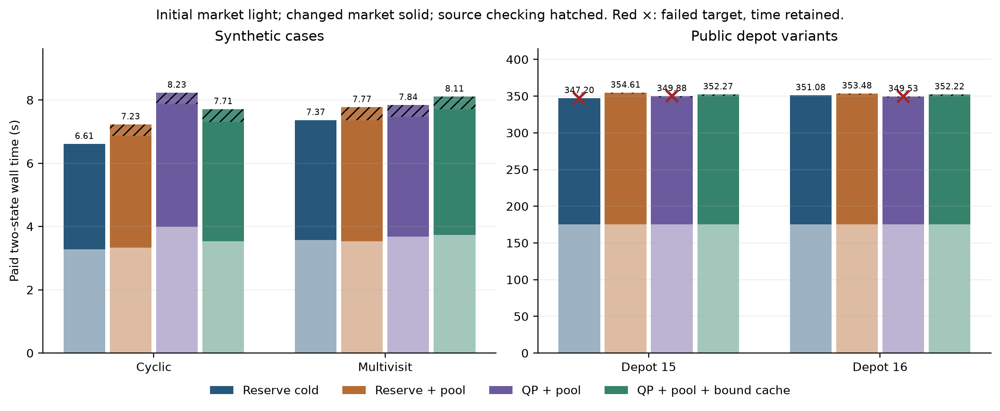
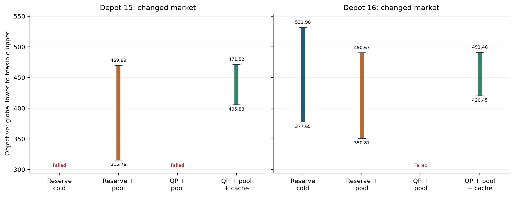

# Ordered solver-baseline comparison: attempt 1

This single fixed-order development run completed all **32 declared cells**: 11 certified, 18 budget-exhausted, and 3 child failures. It compares plan retention, a numerical restricted-pool master, and a checked physical pricing-bound cache in the declared order. The two public depots share one Hildenbrand timetable; they are not independent replications. Source commit: `f4b342dc85799d01d9313baeaf8c9ec527759d59`. The sealed private manifest SHA-256 is `9d141bd48ac0c69cef5624f867b77b4553b9d84022cd555aa2955ce451f02748`; all 260 sealed files were present and unchanged at analysis time. The supervisor reported quiescent sealing, unchanged source hashes, and exit 0. This transport/seal check is distinct from independent scientific evidence review.

The three failures are changed-market public cells: depot 15 reserve cold, and depot 15/16 QP with feasible-pool reuse but no bound cache. Each last pricing call reported native `NO_SOLUTION_FOUND` with no incumbent or plan. The compact oracle wrapper then tried to check extraction policy on the absent plan and raised `ValueError: Compact oracle extraction policy mismatch`. There was no `pricing_result` or new `global_bound` for that call. These are failed child outcomes, not invalid completed physical witnesses and not certified bounds. Their spent child wall times remain in the paid totals.

| Changed-market case | Method | Outcome | Global lower | Feasible upper | Paid two-state s |
| --- | --- | --- | ---: | ---: | ---: |
| Depot 15 | Reserve cold | Failed | — | — | 347.20 |
| Depot 15 | Reserve + pool | Budget exhausted | 315.76 | 469.89 | 354.61 |
| Depot 15 | QP + pool | Failed | — | — | 349.88 |
| Depot 15 | QP + pool + bound cache | Budget exhausted | 405.83 | 471.52 | 352.27 |
| Depot 16 | Reserve cold | Budget exhausted | 377.65 | 531.90 | 351.08 |
| Depot 16 | Reserve + pool | Budget exhausted | 350.87 | 490.67 | 353.48 |
| Depot 16 | QP + pool | Failed | — | — | 349.53 |
| Depot 16 | QP + pool + bound cache | Budget exhausted | 420.45 | 491.46 | 352.22 |

In this run, the completed public QP + cache cells did not hit the rational-polishing stop: reserve + pool ended on projected rational bit-size growth in both changed-market public cells (after 5.71–6.16 s of polishing), while QP + cache used fixed-denominator exact replay and recorded at most 275 rational bits against the configured 4096-bit cap. Its last restricted-pool gaps were about `1.11e-7` and `8.81e-8`, each below the `1e-6` pool tolerance. That checks only the finite column pool. The **global** enclosures remained open by 65.68 and 71.00 objective units, and both cells stopped on native remaining-time budget. Their successful physical pricing calls consumed about 160.01 s each; QP proposal work was 0.77/1.07 s and exact replay 0.51/0.53 s. There is no public certification or equal-quality speedup claim.

Within each QP + cache changed-market run, one fresh physical pricing result was recorded. The selected inherited physical-pricing lower, re-evaluated under the new market's Fenchel conjugate, was 405.83 at depot 15 and 420.45 at depot 16. The best *fresh target* lower recorded in those same runs was 307.01 and 350.62. The inherited evidence therefore strengthened the selected lower by **98.82** and **69.83** units in this posthoc within-run decomposition. It did not permit certification without fresh pricing. The separate QP-without-cache targets failed, so the cross-arm contrast cannot isolate a causal cache speed or quality effect. The cached arm also pays its own state 0 and its parent admission plus child source-check work.

The synthetic cyclic case certified under all four methods at both markets. On synthetic multivisit, reserve cold was budget-exhausted at both markets; the three retained-pool methods certified the changed market. These small cases establish only the declared development-cell outcomes. [Full 32-cell table](analysis/cells.csv), [paid two-state costs](analysis/paid_pairs.csv), and [incremental paired contrasts](analysis/comparisons.csv) preserve every status and time. `analysis/report.json` contains compact pricing and master/QP scalar traces with each source `events.jsonl` SHA-256, not plans, raw variables, or full logs.





The figures and table display global lower endpoints rounded **down** and feasible upper endpoints rounded **up** to two decimals; unrounded stored rational values in the CSV/JSON determine gaps and certification. Exact replay checks stored floating-point evidence; native Gurobi lower bounds still carry solver tolerances and are not ideal-model proofs. A feasible convex mixture of complete fleet plans is not one executable schedule. A restricted-pool residual is not a global hull gap. Paid totals add both child receipts and, for retained arms, the measured parent source-admission check once. Child source verification is already inside the state-1 receipt; it is not added again. Missing components remain unknown, never zero-filled or inferred by subtraction. Failed targets have no displayed final bound interval, but their paid time remains.

The next bounded step is to repair the no-plan return path so native `NO_SOLUTION_FOUND` becomes an explicit unresolved/bounded outcome that preserves only previously verified evidence, with no invented plan or new lower bound. The observed failures do not justify rerunning all 32 cells solely for a status fix. After that, a prospectively timed physical-pricing warm start from an already-known feasible fleet is a plausible baseline for the no-incumbent bottleneck; it remains untested here. This matters for the paper's repeated-planning/price-support question because a fast restricted master alone cannot support changed-market prices while global physical pricing still lacks a tight, valid bound.

## Reproduction and publication boundary

Run from the repository root with the **complete private sealed attempt**, including the manifest and all events. The public scalar subset cannot pass the full manifest check. The repaired environment generates scalar files; the pre-existing local Matplotlib environment renders figures from the checked scalar report:

```sh
PYTHONPATH=src ../.research-venv-repaired-1176/bin/python research-20260928/solver-baseline-comparison/results-attempt1/analyze.py <complete-private-attempt> <new-output-dir>
MPLCONFIGDIR=/private/tmp/egg-solver-baseline-mpl PYTHONPATH=src ../.research-venv/bin/python research-20260928/solver-baseline-comparison/results-attempt1/analyze.py <new-output-dir>/report.json <new-output-dir> --figures-only
PYTHONPATH=src ../.research-venv-repaired-1176/bin/python research-20260928/solver-baseline-comparison/results-attempt1/analyze.py <complete-private-attempt> research-20260928/solver-baseline-comparison/results-attempt1 --selection-only
```

The figures-only command also works from the published `analysis/report.json` without the private attempt; rebuilding scalar tables still requires the complete sealed archive. The derived report pins the frozen input, sealed summary, wrapper receipt, per-cell events, and all frozen source hashes. [PUBLIC_SELECTION.json](PUBLIC_SELECTION.json) lists each emitted public file and every private sealed input omitted from this directory with its source hash and omission reason. The raw Gurobi logs, native event streams, plans, and private environment snapshot remain in the sealed archive.
