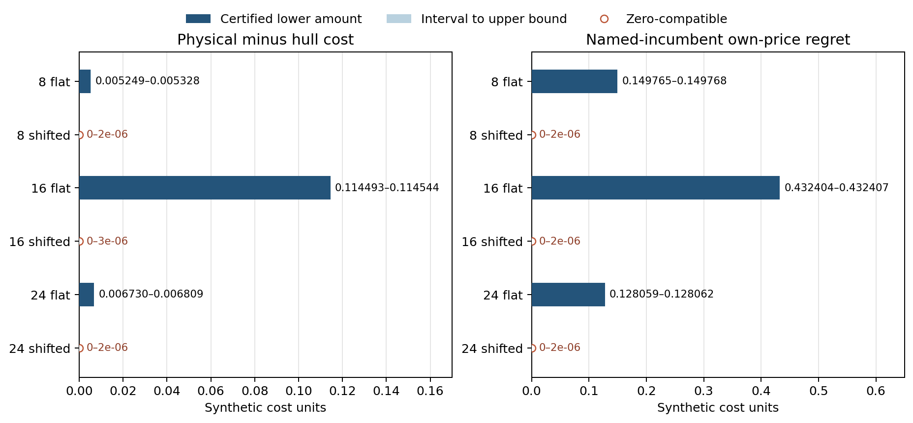

# Matched physical, hull, and own-price evidence on six development cells

The three **flat-source** cells have positive, native tolerance-qualified physical-minus-hull gap lower bounds: at least 0.005249, 0.114493 and 0.006730 synthetic cost units for 8, 16 and 24 services. “Flat” means a constant linear price intercept across hours; the positive quadratic supply curvature remains. Their named planner incumbents also have positive own-price-response regret. The three shifted-target cells have gap intervals containing zero and regret no larger than about `2e-6` in the outward display. All twelve new planner/response stages certified with complete on-time evidence. The imported QP hull stage had likewise certified all six cells. This is a same-model result on one nested synthetic development family, not an exact proof for the ideal model or evidence about a public timetable.

| Services | Market | Physical \(D\) | Hull \(CH\) | \(D-CH\) | Incumbent regret | Planner / response calls | Child s, planner + response |
| ---: | --- | --- | --- | --- | --- | ---: | ---: |
| 8 | Flat source | [445.1424, 445.1425] | [445.1371, 445.1372] | [0.005249, 0.005328] | [0.149765, 0.149768] | 10 / 1 | 2.88 + 1.93 |
| 8 | Shifted target | [427.9219, 427.9220] | [427.9219, 427.9220] | [0, 0.000002] | [0, 0.000002] | 2 / 1 | 1.88 + 1.78 |
| 16 | Flat source | [488.9672, 488.9674] | [488.8527, 488.8528] | [0.114493, 0.114544] | [0.432404, 0.432407] | 11 / 1 | 12.62 + 2.53 |
| 16 | Shifted target | [471.1218, 471.1219] | [471.1218, 471.1219] | [0, 0.000003] | [0, 0.000002] | 2 / 1 | 3.99 + 3.28 |
| 24 | Flat source | [539.2915, 539.2916] | [539.2847, 539.2848] | [0.006730, 0.006809] | [0.128059, 0.128062] | 9 / 1 | 98.12 + 7.55 |
| 24 | Shifted target | [542.3015, 542.3016] | [542.3015, 542.3016] | [0, 0.000002] | [0, 0.000002] | 2 / 1 | 13.81 + 8.34 |

Every lower endpoint is rounded **down** and every upper endpoint **up**; the [paired JSON](compactrows.json) and [CSV](compactrows.csv) preserve all twelve stage statuses and child costs, exact-fraction endpoint hashes, source lineage and scalar native-solver times. In the joint comparison, the imported hull upper is tightened by the physical upper witness and the physical lower by the hull lower before computing a nonnegative gap; the raw stage intervals remain separate. The flat-source lower gaps are small relative to physical cost—the largest is about 0.024% at 16 services—but strictly above the native numerical uncertainty in these cells. Such synthetic economic magnitudes do not imply operational materiality.

The [vector figure](joint_economic_evidence.svg) distinguishes a certified positive lower amount from the short interval to its upper bound. Open markers denote zero-compatible intervals, including all shifted-target cases. The regret belongs to the **returned, replayed planner incumbent** in each row. Its planner stage certified a `1e-4` native enclosure, but these computations do not identify an exact ideal-model optimizer or prove its own-price regret. The fixed-price response used the gradient of that named incumbent's load and the same physical feasible set. A certified positive planning gap is the stronger support obstruction in the flat-source native model; a price-update trajectory was not run.

A narrow inspection of the twelve saved physical plans found four used buses and operating cost 400 in every planner and response result. Thus the observed incumbent response can improve the fixed-price bill without changing fleet size. The imported hull mixtures' fleet compositions were not examined here.

The six planner child times sum to 133.29 s and the six response child times to 25.42 s. Within them, recorded native solver time sums to 113.24 and 12.81 s, respectively; model construction and other preparation are not separately timed. The 24-service flat planner dominates new paid time at 98.12 s, with 91.22 s recorded native optimization. The wrapper reports 10 s setup and 174 s whole-wrapper time; the supervisor reports 161.58 s. Slurm job `597526` completed in 176 s. These clocks have different boundaries and must not be added. The imported hull evidence came from separate QP job `595105` (107 s Slurm elapsed): it was reused analytically here, **not obtained for free** as part of this run. No runtime acceleration comparison follows from this accounting.

The six cases use 8/16/24 services nested within one generated seed-1006 family, each at the same flat-source and shifted-target markets. Complete physical case and market identities match the imported QP hull evidence. The new source commit was `41fa5f1e23833922292e2f70e346f386485aaa51`; the hull source commit was `60a66e77be18e067aee4026f0e3a31dc120ec427`. Native mixed-integer bounds and physically replayed plans retain solver and replay tolerances. Independent timetable groups remain reserved; this experiment establishes neither prevalence nor general speedup or ML performance.

The [summary-only curator](summarize.py) reproduces the paired rows from frozen declarations, stage results/receipts and the pinned QP summary, without opening events or invoking an optimizer. [The plotting script](plot.py) uses only the compact JSON.
