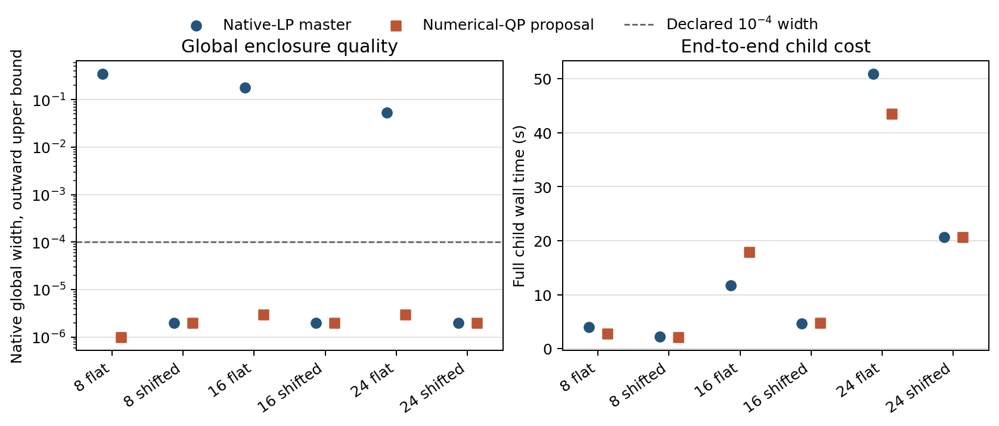

# Paired cold native-LP and numerical-QP master diagnosis

The numerical-QP proposal **removed the observed flat-market arithmetic stop** in this six-cell development family. All three flat-source QP cells certified within the declared `1e-4` native global-width criterion, whereas the matched native-LP cells stopped on projected rational-bit growth with useful but wider enclosures. Both methods certified all three shifted-target cells. Every QP child returned on time with complete evidence; the six frozen case/market identities, market payloads, order, physical pricing budget and other controls match the sealed LP baseline. The only execution-policy change was the restricted master: native LP versus the existing numerical-QP proposal with denominator `10^9`, at most 500 iterations, and exact replay.

| Services | Market | LP outcome; width ≤ | QP outcome; width ≤ | Calls LP→QP | Child s LP→QP | QP proposal / replay s |
| ---: | --- | --- | --- | ---: | ---: | ---: |
| 8 | Flat source | Bit stop; 0.347382 | Certified; 0.000001 | 3→5 | 3.94→2.78 | 0.266 / 0.081 |
| 8 | Shifted target | Certified; 0.000002 | Certified; 0.000002 | 2→2 | 2.23→2.13 | 0.220 / 0.008 |
| 16 | Flat source | Bit stop; 0.181109 | Certified; 0.000003 | 4→10 | 11.71→17.89 | 0.191 / 0.763 |
| 16 | Shifted target | Certified; 0.000002 | Certified; 0.000002 | 2→2 | 4.69→4.74 | 0.188 / 0.016 |
| 24 | Flat source | Bit stop; 0.053880 | Certified; 0.000003 | 5→6 | 50.87→43.47 | 0.226 / 0.458 |
| 24 | Shifted target | Certified; 0.000002 | Certified; 0.000002 | 3→3 | 20.61→20.61 | 0.258 / 0.087 |

Widths round **up** to six decimals; native lower endpoints round down and upper endpoints up to four in the [paired JSON](compactrows.json) and [CSV](compactrows.csv). Those files retain all six cells, statuses, stop reasons, rational-bit maxima, component times and hashes of the sealed QP exact-fraction endpoint text. The QP flat-source intervals are `[445.1371, 445.1372]`, `[488.8527, 488.8528]` and `[539.2847, 539.2848]` at 8, 16 and 24 services. Their respective maxima were 273, 269 and 262 rational bits, compared with 8025, 7978 and 8186 in the LP flat cells. QP had zero recorded non-success proposals in all six cells. A bit-limit stop is **not** a certification even when it preserves a bounded native interval.

The [vector figure](paired_quality_cost.svg) puts the common `1e-4` width threshold beside full child wall time. It shows the meaningful result—QP makes the flat-source cells certifiable under the same caps—without implying a uniform time gain. The 16-service flat QP cell took six more pricing calls and 6.18 s more child time; the 24-service flat QP cell took one more pricing call and 7.40 s less. Target-market times are nearly unchanged. Across these six **sequential** children, QP recorded 91.62 s versus 94.05 s for LP, but this is not a speedup estimate: there is one seed, one nested synthetic family, one run per arm, and no variance estimate. Both Slurm attempts used `unicorn-cpu-87`, yet time and pricing trajectories can still vary.

Native route-pricing solver time is the largest recorded QP component at 16 and 24 services: 11.86 and 36.49 s for flat source, and 2.34 and 16.52 s for shifted target. Across all QP cells it sums to 67.35 s; QP proposal and exact replay sum to 1.35 and 1.41 s respectively. The LP arm recorded 58.17 s route pricing, 15.53 s rational polishing, and small native-LP master solves. These components are **not** a decomposition of full child wall time: model construction and other preparation were not separately measured. The QP rows leave native-LP master time *not applicable*, not zero total master work. QP's zero legacy polish counter likewise does not erase its recorded proposal and replay work.

The QP wrapper records 6 s setup and 102 s whole-wrapper time; its supervisor records 94.16 s. Slurm accounting records job `595105` completed in 107 s with exit `0:0`. These clocks have different boundaries and should not be added. The frozen source commit is `60a66e77be18e067aee4026f0e3a31dc120ec427`; the matched LP source was `e3ac75fc53c00594572126413b704ab1de42086e`. The QP supervisor sealed a quiescent, unchanged source tree, and freeze/preflight/supervision returned zero. Native global enclosures retain solver and physical-replay tolerances; they are not exact ideal-hull proofs.

**Next study.** First complete matched physical-planner \(D\), convexified-hull \(CH\), and own-price-response regret evidence on these same six solvable development cells, preserving native bounds, failures and full end-to-end cost for each stage. Then design a separate cold/retained/nearest-neighbor comparison at common evidence quality, with all starts, source selection, calls and child costs accounted. Keep independent test groups reserved; do not open held-out or protected data, or retry or alter the failed frozen retrieval attempt `584876`. These six cells establish calibration feasibility, not transfer, ML performance or a general speedup.

Run [the summary-only curator](summarize.py) on the sealed QP attempt to reproduce the paired CSV/JSON; [the plotting script](plot.py) reads only that compact JSON. Neither invokes an optimizer or inspects event logs.
