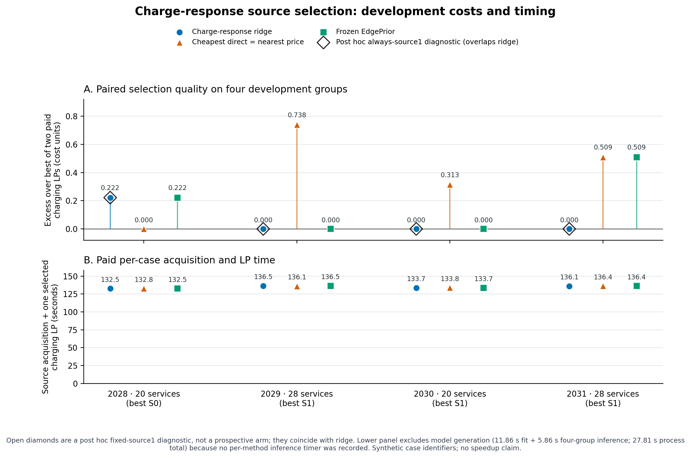

# Charge-response source-selection results

The fixed ridge model selected source 1 in all four development cases. The best of the two paid post-charge linear programs selected source 0 once and source 1 three times. The majority among the six training-pair winners was also source 1, and a post hoc always-source-1 rule exactly reproduces all four ridge choices and paired costs. This small development set therefore does not demonstrate adaptive learning or a general machine-learning advantage.

The campaign accounted for 44/44 cells, all feasible and returned without missing artifacts. All six training pairs (12 charge labels) were complete. The four development predictions were frozen before any development target charging LP or cold solve. The reserved test groups were not materialized. An independent replay checked all 44 saved cells, training labels, prediction order and hashes; see [the replay receipt](INDEPENDENT_REPLAY_CHARGE_RESPONSE.json).

| Synthetic case ID | Services | Best paid LP | Ridge | Cheapest direct / nearest price | Frozen EdgePrior | Post hoc always source 1 |
|---|---:|---|---|---|---|---|
| 2028 | 20 | S0 | S1, +0.222 | S0, +0.000 | S1, +0.222 | S1, +0.222 |
| 2029 | 28 | S1 | S1, +0.000 | S0, +0.738 | S1, +0.000 | S1, +0.000 |
| 2030 | 20 | S1 | S1, +0.000 | S0, +0.313 | S1, +0.000 | S1, +0.000 |
| 2031 | 28 | S1 | S1, +0.000 | S0, +0.509 | S0, +0.509 | S1, +0.000 |

Each excess is in cost units relative to the better result from charging either archived source fleet with that case's target prices. Cheapest-direct and nearest-price select the same source in all four cases. Their mean paired excess is 0.3901; the ridge mean is 0.0555 and the frozen EdgePrior mean is 0.1827. The training-pair winners were source 0 twice and source 1 four times, so the post hoc majority rule is exactly the constant source-1 diagnostic. It was not a prospectively declared campaign arm.

The separate cold target solves returned feasible physical plans, but all four native runs ended `budget_exhausted`; they do not establish physical optimality. Their saved feasible costs, valid hull lower bounds and native mixture uppers are:

| Synthetic case ID | Cold feasible cost | Hull lower bound | Native mixture upper | Native status | Wall time |
|---|---:|---:|---:|---|---:|
| 2028 | 510.991 | 506.728 | 510.477 | budget_exhausted | 64.04 s |
| 2029 | 583.535 | 579.512 | 583.440 | budget_exhausted | 65.20 s |
| 2030 | 509.994 | 509.339 | 509.456 | budget_exhausted | 61.03 s |
| 2031 | 679.901 | 570.846 | 678.079 | budget_exhausted | 65.45 s |

The cold feasible cost is the physical-plan upper bound; the hull lower bound also lower-bounds the physical optimum. A native mixture upper is a separate relaxed quantity and is not necessarily a physical-plan upper bound. These cold outcomes are not the same comparison as selecting between the two fixed-route charging LPs above.

Training and model generation took 27.812 seconds in total and completed before all development target cells. The recorded components were 11.861 seconds for training, including training-sample preparation/replay, and 5.864 seconds for four-group inference and validation; no method-specific inference time was recorded. Frozen EdgePrior baseline choices took 5.805 seconds. Per development case, the recorded full source-acquisition cost plus one selected target charging LP took 132.545–136.471 seconds for ridge, 132.755–136.359 seconds for cheapest-direct/nearest, and 132.545–136.471 seconds for EdgePrior. Those per-case figures charge source acquisition and one selected LP, but exclude shared model generation. They do not support a speedup claim.

The batch ran on `snavely-cpu-01`: Slurm elapsed 1,427 seconds, wrapper elapsed 1,421 seconds, one allocated logical CPU, 8 GB requested memory and 246,832 KiB maximum RSS. The result table can be regenerated with [the summarizer](summarize_charge_response.py); the figure is generated by [the plotting script](plot_charge_response.py).

[Vector figure](figures/charge_response_quality_time.svg) · [44-cell CSV](CHARGE_RESPONSE_CELLS.csv)

A separate five-plan comparison (two original sources, two charged versions and cold) found positive own-price deviation witnesses at the best saved incumbent in cases 2028, 2030 and 2031: 1.254, 0.444 and 1.723 cost units. The case-2030 incumbent is within 0.655 of the physical optimum under its compatible cold lower bound. These are incumbent-level witnesses; the zero witness in case 2029 does not certify support, and support of the unknown exact optima remains unresolved. The exact plans, bounds and comparisons are in the independent replay receipt.
