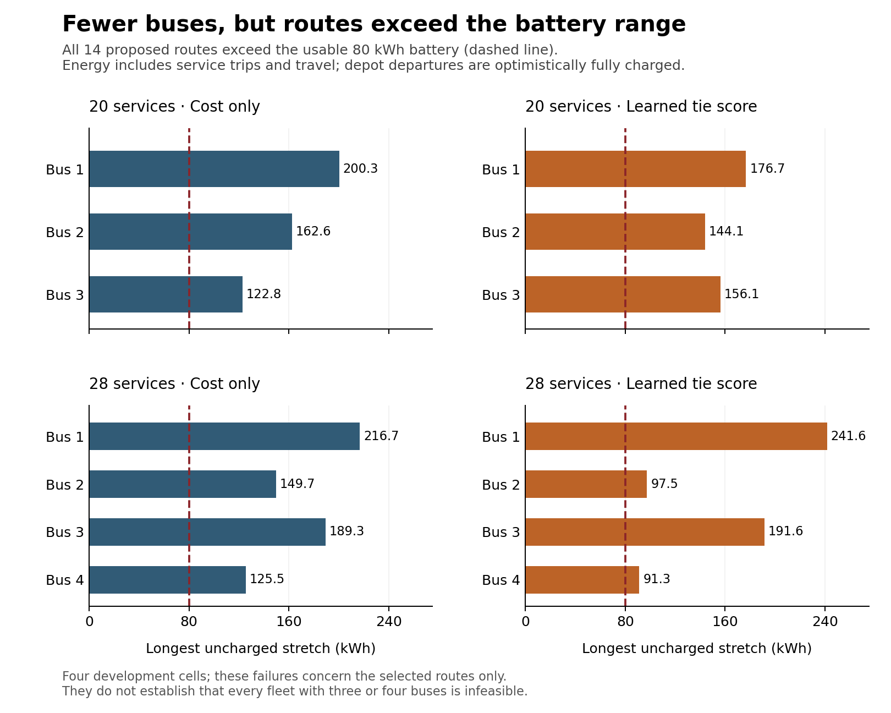

# Cost-aware repair results

Slurm job 685697 completed in 4:43 with exit code 0, one allocated CPU, 8 GB
requested memory, and 229,396 KiB maximum RSS. All four children returned
within their 240-second caps. Each path-cover MILP returned native optimal
status with zero reported gap and a reported minimum structural bus count:
three buses for the 20-service case and four for the 28-service case. Those
certificates cover declared routes only; they do not establish charging
feasibility.

All four fixed-route charging subproblems returned `INFEASIBLE`. The runner
therefore used the archived source0 fleet in each cell. No cell produced a
newly repaired fleet or a direct cost for one.

| Order | Case | Decoder | Proposed structural buses | Charging | Selected fleet / buses | Source0 fallback direct cost | Target hull status; lower–mixture upper; pricing / master calls |
|---:|---|---|---:|---|---|---:|---|
| 1 | 20 services (2016) | Cost only | 3 (proved minimum) | Infeasible | Source0 fallback / 4 | 553.47 | `budget_exhausted`; 515.285–515.439; 4 / 5 |
| 2 | 20 services (2016) | Cost + learned tie score | 3 (proved minimum) | Infeasible | Source0 fallback / 4 | 553.47 | `budget_exhausted`; 515.285–515.439; 4 / 5 |
| 3 | 28 services (2017) | Cost + learned tie score | 4 (proved minimum) | Infeasible | Source0 fallback / 5 | 724.66 | `budget_exhausted`; 579.539–686.654; 2 / 3 |
| 4 | 28 services (2017) | Cost only | 4 (proved minimum) | Infeasible | Source0 fallback / 5 | 724.66 | `budget_exhausted`; 579.539–686.654; 2 / 3 |

The saved global lower certificates and mixture uppers replayed, and the fresh
independent physical replay of all four fallback plans passed with matching
exact costs ([replay receipt](INDEPENDENT_REPLAY_COST_AWARE.json)). The
certified hull lower bound is also a lower bound on the physical optimum. The
mixture upper bounds the target convex-hull relaxation; it is not necessarily
the cost of any one integer fleet and is not a physical feasible upper bound.

| Case | Decoder | Inference / cover / charge (s) | Repair total (s) | Fallback selection / independent replay / pool (s) | Hull (s) | Child (s) |
|---|---|---:|---:|---:|---:|---:|
| 2016 | Cost only | 0.000 / 1.719 / 0.249 | 1.968 | 0.453 / 0.055 / 0.169 | 59.821 | 66.080 |
| 2016 | Cost + learned tie score | 0.036 / 0.449 / 0.245 | 0.731 | 0.444 / 0.055 / 0.168 | 59.632 | 64.320 |
| 2017 | Cost + learned tie score | 0.076 / 0.440 / 0.553 | 1.070 | 0.531 / 0.098 / 0.336 | 61.176 | 66.670 |
| 2017 | Cost only | 0.000 / 1.005 / 0.553 | 1.559 | 0.531 / 0.100 / 0.339 | 61.188 | 67.219 |

The source0 fallback costs, 553.47 and 724.66, match the cached source0 target
costs in Stage 2; source1 cost 586.76 and 749.31 in those cases. Stage 2's
learned and cheapest arms had physical incumbents 515.52 and 689.47, and this
run recovered the same hull intervals from the fallback pool. The earlier
route-fixed score-only repair produced replayed 18- and 28-bus fleets at
1,919.93 and 2,999.52. The new decoders proved smaller structural covers, but
those covers failed charging. Learned scores selected a different cover than
cost-only in each case, yet did not yield a feasible repaired fleet, better
fallback cost, or a different hull result. Thus this run shows no learned
quality benefit. It also does not show a solve-time advantage: there are only
two development cases and no replication.

Energy diagnosis found that every proposed route requires more than 80 kWh
between charge opportunities. The next experiment should add one necessary SOC
relaxation to the cover: allow an optimistic full-SOC reset at each declared
positive-power charging opportunity, then enforce the battery-energy limit
between resets. Run the same full fixed-route charging LP on the resulting
cover. This tests whether a charge-feasible route can be selected without
adding speculative alternate-cover retries; retain the frozen cases, caps,
and no-refit/test restrictions, and report physical feasibility and hull
bounds separately.

The four-cell ledger, including missing-artifact handling, saved replay flags,
and phase timings, is in [COST_AWARE_REPAIR_CELLS.csv](COST_AWARE_REPAIR_CELLS.csv).
The archived comparators are [route-fixed repair](RESULTS_REPAIR.md) and
[Stage 2](RESULTS_STAGE2.md). I summarized compact receipts only and did not
inspect event traces or run optimization; the fresh physical replays are
recorded in the linked receipt.

The [route-energy diagnosis](ENERGY_FEASIBILITY_DIAGNOSIS.md) independently rejects all 14 proposed vehicle routes: each has an uncharged stretch exceeding the usable 80 kWh battery. This statement concerns the selected routes, not every fleet of that size.

