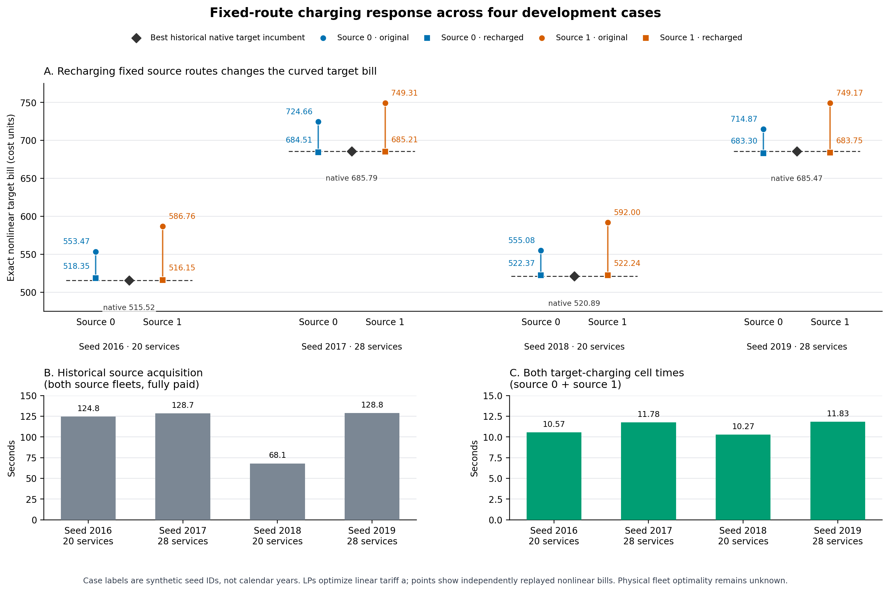

# Fixed-source charging results

The labels 2016–2019 below are synthetic case/seed identifiers, not calendar years. All eight fixed-route charging cells returned an optimal solution for the **linear** target tariff `market.a`; the independent replay confirms the original and charged plans, identities, hashes, and exact costs for all eight pairs in [INDEPENDENT_REPLAY_FIXED_SOURCE_CHARGE.json](INDEPENDENT_REPLAY_FIXED_SOURCE_CHARGE.json). Each charged plan also passed exact nonlinear target-cost rescoring. The nonlinear bill uses both target tariff terms, so LP optimality does not imply nonlinear or fleet-level optimality. Because multiple LP optima can tie under the linear tariff while producing different curved bills, each recharged cost is the result of this particular LP solve and is not an intrinsic minimum curved bill for that route topology. No fresh target hull was run.

| Development case | Source 0: original → recharged (change) | Source 1: original → recharged (change) |
|---|---:|---:|
| 2016 · 20 services | 553.475 → 518.348 (−35.127) | 586.760 → 516.150 (−70.610) |
| 2017 · 28 services | 724.660 → 684.511 (−40.149) | 749.310 → 685.211 (−64.099) |
| 2018 · 20 services | 555.084 → 522.371 (−32.713) | 592.004 → 522.239 (−69.765) |
| 2019 · 28 services | 714.867 → 683.304 (−31.563) | 749.168 → 683.750 (−65.419) |

Every fixed-route LP reduced the exact nonlinear target bill relative to its inherited source charging schedule. The figure shows unchanged and recharged plan costs separately from the best historical target-native incumbent; acquisition and charging-cell time use separate panels.

[Vector figure](figures/fixed_source_charge_cost_time.svg) · [Plot script](plot_fixed_source_charge.py) · [Eight-cell table](FIXED_SOURCE_CHARGE_CELLS.csv) · [Summarizer](summarize_fixed_source_charge.py)

| Case | Frozen learned one-LP choice | Cheapest-original one-LP choice | Best of both recharged sources | Best historical target-native incumbent | Best recharged − historical incumbent |
|---|---:|---:|---:|---:|---:|
| 2016 | Source 0 · 518.348 | Source 0 · 518.348 | Source 1 · 516.150 | 515.516 | +0.635 |
| 2017 | Source 0 · 684.511 | Source 0 · 684.511 | Source 0 · 684.511 | 685.789 | −1.277 |
| 2018 | Source 1 · 522.239 | Source 0 · 522.371 | Source 1 · 522.239 | 520.892 | +1.347 |
| 2019 | Source 1 · 683.750 | Source 0 · 683.304 | Source 0 · 683.304 | 685.468 | −2.163 |

The best recharged plan beats the historical native incumbent in 2017 and 2019, while remaining 0.635 and 1.347 cost units above it in 2016 and 2018. These are comparisons to saved feasible incumbents, not to proven physical optima. The historical target-arm statuses and bounds remain archived development evidence; the present fixed-source LPs provide no new global physical bound.

The cheapest unchanged source is Source 0 in all four cases. The frozen learned choice is Source 0, Source 0, Source 1, Source 1; after charging, Source 1 is better in 2016 and 2018, while Source 0 is better in 2017 and 2019. The learned single-LP choice matches the better recharged fleet in 2017 and 2018; it misses Source 1 by 2.198 cost units in 2016 and Source 0 by 0.445 in 2019. The four cases show mixed selection performance and do not establish a general learning advantage.

| Case | Historical acquisition for both sources | Two charging-cell child times summed | Acquisition + two cells, partial paid path |
|---|---:|---:|---:|
| 2016 | 124.823 s | 10.575 s | 135.398 s |
| 2017 | 128.724 s | 11.780 s | 140.505 s |
| 2018 | 68.084 s | 10.275 s | 78.358 s |
| 2019 | 128.820 s | 11.835 s | 140.655 s |

The source acquisition totals include both saved source fleets and are fully paid in the prospective accounting; the table's acquisition-plus-cell sum is still partial, not an end-to-end total. It excludes shared model preparation/inference and selection. The stage-2 model preparation took 14.966 seconds once for that frozen model artifact; the later frozen-model transfer inference took 3.995 seconds once for the transfer artifact. The learned one-LP source-choice prediction took 0.249–0.595 seconds per case where applicable; selection took 0.616–1.382 seconds per case. Individual charging-cell child time was 5.137–5.940 seconds, including replay and accounting around the LP. The new Slurm job itself completed in 84 seconds (wrapper 78 seconds), requested one CPU but received two allocated CPUs, used one native thread and 8 GB, and reached 154,000 KiB MaxRSS on `snavely-cpu-16`. Its wall time excludes historical source-acquisition and model-artifact preparation runs; those shared costs are shown separately. There is no matched-runtime speedup claim.

The next evaluation trains a post-charge source selector on groups 2022–2027, freezes choices for development groups 2028–2031 before target charging or cold outcomes, and keeps the reserved test groups unobserved. It tests whether the source-ranking model predicts which fixed route will yield the lower target-rescored charge plan; these four development cases alone do not justify automatic model-tuning claims.
