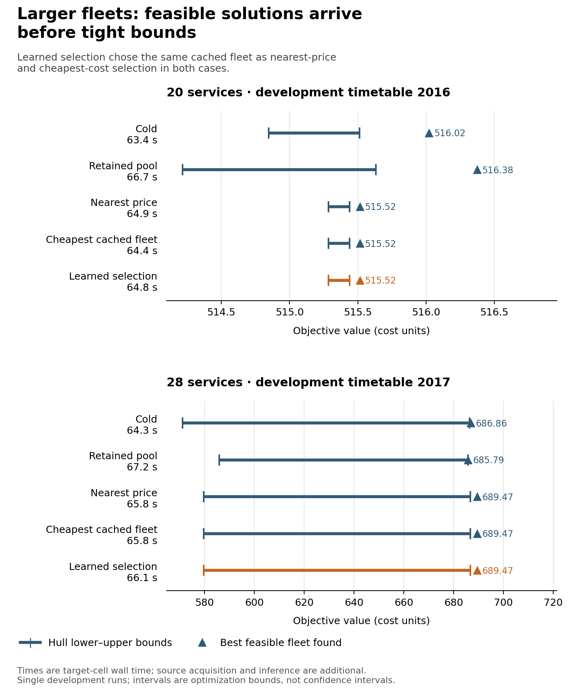

# Stage 2 results

The run completed successfully: Slurm job 678708 finished in 38:05 on one allocated logical CPU, with 258,724 KiB maximum batch RSS. All 44 cells returned code 0 with a replayed feasible fleet; none hit the 100-second child timeout (maximum child wall time 67.269 seconds). Native hull outcomes were 5 `certified`, 37 `budget_exhausted`, and 2 `stalled_bounded`. Every cell replayed both its saved hull lower certificate and feasible-mixture upper bound. All physical fleet labels remain best-known feasible incumbents with `optimality=unknown`; a hull certificate does not prove physical schedule optimality.

The controller recorded 130 pricing requests and 143 master calls across the 44 cells. The complete cell ledger, including service count, status, wall time, physical incumbent, hull bounds, calls, and cap/failure fields, is in [RESULTS_STAGE2_CELLS.csv](RESULTS_STAGE2_CELLS.csv).

The trainer succeeded before either development cold solve. It used 18 feasible labels from six training groups (three hull-certified and 15 budget-exhausted; every physical label remains provisional), from 36 input rows that also contained both development source pools and frozen target-market inputs. The two reserved test groups remained unobserved. Trainer time was 14.389 seconds; the outer learning receipt, including proposal generation and saved outputs, took 14.966 seconds.

| Development case | Arm | Native hull status | Seconds | Pricing / master calls | Physical incumbent | Hull lower – mixture upper |
|---|---|---:|---:|---:|---:|---:|
| 20 services (2016) | Cold | stalled_bounded | 63.39 | 4 / 3 | 516.022 | 514.846 – 515.512 |
|  | Retained | budget_exhausted | 66.67 | 3 / 4 | 516.375 | 514.217 – 515.632 |
|  | Nearest price | budget_exhausted | 64.88 | 4 / 5 | 515.516 | 515.285 – 515.439 |
|  | Cheapest bill | budget_exhausted | 64.43 | 4 / 5 | 515.516 | 515.285 – 515.439 |
|  | Learned | budget_exhausted | 64.79 | 4 / 5 | 515.516 | 515.285 – 515.439 |
| 28 services (2017) | Cold | budget_exhausted | 64.31 | 2 / 2 | 686.862 | 571.169 – 686.334 |
|  | Retained | budget_exhausted | 67.17 | 2 / 3 | 685.789 | 585.914 – 685.789 |
|  | Nearest price | budget_exhausted | 65.82 | 2 / 3 | 689.474 | 579.539 – 686.654 |
|  | Cheapest bill | budget_exhausted | 65.82 | 2 / 3 | 689.474 | 579.539 – 686.654 |
|  | Learned | budget_exhausted | 66.12 | 2 / 3 | 689.474 | 579.539 – 686.654 |

No development target arm closed its hull bracket. At 20 services, learned matched nearest-price and cheapest-bill and had a 0.506 lower incumbent cost than cold. At 28 services, learned again matched both controls; its incumbent was 2.612 above cold and 3.685 above retained. These are comparisons of feasible incumbents, not physical optimality claims, and they do not show a consistent learned-arm gain.

Both learned proposals selected source0, the same source selected by first-source, nearest-price, and cheapest-bill. Source0's direct target bill was 553.475 versus 586.760 for source1 in 2016, and 724.660 versus 749.310 in 2017. Source acquisition took 124.823 and 128.724 seconds per development case (both source cells combined). Online validation, scoring, and topology prediction took 0.249 and 0.497 seconds; each learned target solve then took about 65–66 seconds. The training receipt is shared across both cases. Native source and target solves dominate proposal/model work, and the proposal remains limited to projection onto the two existing complete source fleets.

These results support the planned bounded route-fixed charging-repair pilot on the frozen model and development cases. It will decode new routes from learned scores, then hold those routes fixed while solving for feasible charging schedules. This can expand the feasible proposal pool beyond the two stored source fleets. Stage 2 gives no reason to claim a learned quality or solve-time advantage, and no reason to move the reserved test groups into development.

The source is the immutable attempt at [20260930-stage2-attempt1](../../result/learning_campaign/20260930-stage2-attempt1), with [Slurm accounting](ACCOUNTING_678708.json), [wrapper receipt](20260930-stage2-attempt1.slurm_wrapper_receipt.678708.json), [download manifest](RESULT_MANIFEST_STAGE2.json), and [Stage 2 protocol](PROTOCOL_STAGE2.md). Independent receipt review supports admitting this run as development evidence for the frozen synthetic profile. It establishes neither physical schedule optimality nor a learning benefit; the reserved test groups remain untouched.
