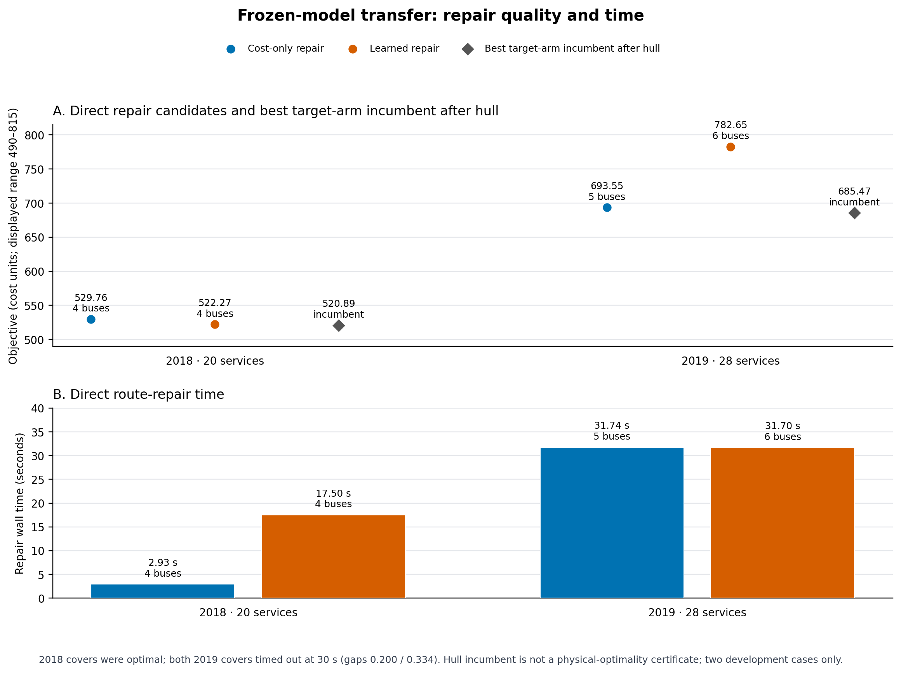

# Frozen-model transfer campaign results

The figure separates direct route repair from the later hull checks. [Vector figure](figures/transfer_campaign_cost_time.svg) · [Plot script](plot_transfer_campaign.py).

Job 696441 completed successfully in 941 seconds with one allocated CPU and 8 GB; the catalog contains 18/18 feasible cells, and all four newly repaired fleets passed their independent replay. The frozen model was not refit. Its single inference call completed before any target cell, and the 2018/2019 cases were held out from the stage-2 fit and labels. These two development cases provide transfer evidence only.

The target-table “direct proposal” is the selected source-pool plan's target-price cost before the target hull search. “After hull” is the best feasible incumbent returned by that target-native search. Hull lower bounds are lower bounds on physical optimum; the reported mixture upper is not necessarily a feasible physical fleet cost. A `certified` hull status does not establish physical fleet optimality.

| Case | Target arm | Direct proposal | After hull | Hull status | Lower / mixture upper |
|---|---|---:|---:|---|---:|
| 2018 · 20 services | Cold | — | 520.89 | Budget exhausted | 520.701254 / 520.793307 |
| 2018 · 20 services | Retained | 554.97 | 520.89 | Certified | 520.793306 / 520.793307 |
| 2018 · 20 services | Nearest price | 555.08 | 520.89 | Certified | 520.793306 / 520.793307 |
| 2018 · 20 services | Cheapest bill | 555.08 | 520.89 | Certified | 520.793306 / 520.793307 |
| 2018 · 20 services | Learned | 592.00 | 520.89 | Certified | 520.793306 / 520.793307 |
| 2019 · 28 services | Cold | — | 685.47 | Budget exhausted | 567.791443 / 685.346763 |
| 2019 · 28 services | Retained | 714.87 | 689.53 | Stalled bounded | 575.340765 / 689.533471 |
| 2019 · 28 services | Nearest price | 714.87 | 689.53 | Budget exhausted | 575.340765 / 689.533471 |
| 2019 · 28 services | Cheapest bill | 714.87 | 689.53 | Budget exhausted | 575.340765 / 689.533471 |
| 2019 · 28 services | Learned | 749.17 | 685.71 | Budget exhausted | 558.673698 / 685.709055 |

| Case | Repair arm | Replayed candidate | Cover result | Repair time | Replay / pool / hull | Worker / child time | Hull status and lower / mixture upper |
|---|---|---:|---|---:|---:|---:|---|
| 2018 · 20 services | Cost only | 529.76 · 4 buses | Optimal, gap 0 | 2.93 s | 0.05 / 0.19 / 17.69 s | 23.40 / 24.04 s | Certified · 520.793306 / 520.793307 |
| 2018 · 20 services | Learned | 522.27 · 4 buses | Optimal, gap 0 | 17.50 s | 0.05 / 0.23 / 18.26 s | 38.70 / 39.42 s | Certified · 520.793306 / 520.793307 |
| 2019 · 28 services | Cost only | 693.55 · 5 buses | Time limit, gap 0.200 | 31.74 s | 0.12 / 0.36 / 61.30 s | 96.35 / 97.06 s | Budget exhausted · 587.845785 / 687.377304 |
| 2019 · 28 services | Learned | 782.65 · 6 buses | Time limit, gap 0.334 | 31.70 s | 0.11 / 0.36 / 61.40 s | 96.62 / 97.52 s | Budget exhausted · 584.254030 / 686.018753 |

In the target table, the native worker / outer child elapsed times for the learned arm were 23.89 / 24.45 seconds in 2018 and 65.43 / 66.20 seconds in 2019. These worker values include source lookup; child values additionally include wrapper overhead. The repair timing chart shows the direct route-repair phase only.

In 2018, the learned repair produced a feasible 4-bus plan 7.49 cost units below the cost-only repair, but took about six times as long. In 2019, learned repair returned a 6-bus candidate costing 89.10 more than the 5-bus cost-only candidate; both covers hit their 30-second limit, so neither returned bus count is a proven minimum. This is a mixed two-case result, not evidence of a general learning advantage or speedup. The learned selector chose source 1 in both cases. Its old charging schedule had a higher direct bill than source 0 (592.00 vs 555.08 in 2018; 749.17 vs 714.87 in 2019), but the selector ranks route topology to help the native target solve. Those unreoptimized bills alone do not establish that the chosen route topology was inferior; the current repair constructs new routes rather than fixing the stored source-1 topology. The planned fixed-source-route LP will isolate source 0 versus source 1 route topology while re-optimizing charging for the target case.

Accounting separates the one-time data/model path from each target worker. Source acquisition took 68.084 seconds for 2018 and 128.820 seconds for 2019; the frozen-model inference and proposal write took 3.995 seconds once, before all target cells. Learned proposal validation/scoring plus topology prediction took 0.275 seconds for 2018 and 0.595 seconds for 2019. Learned-cell lookup took 2.884 and 3.287 seconds, and direct replay/rescoring took 0.041 and 0.084 seconds. The corresponding full learned target workers took 23.89 and 65.43 seconds. For repaired cells, the table keeps cover/repair, independent replay, pool setup, and hull wall time separate; a complete repair-worker time was 23.40/38.70 seconds for 2018 and 96.35/96.62 seconds for 2019 (cost-only/learned). Thus the repair timing is not an end-to-end speedup comparison.

Independent physical-pool replay supplies a tighter, compatible view than any one run's mixture upper. For 2018, the 44 saved columns (21 unique) gave a best feasible plan of 520.892028 and strongest target lower bound 520.793306, leaving at most a 0.098722 gap. At that incumbent's own prices, a 4-bus deviation witness saves at least 0.486362, but its true target cost is 521.004698. For 2019, the 26 saved columns (16 unique) gave a best feasible plan of 685.467701 and strongest target lower bound 587.845785, leaving a 97.621916 gap; its own-price witness is 6.171677. These limited-pool results do not establish support of the unknown physical optimum. Details are in [the independent replay receipt](INDEPENDENT_REPLAY_TRANSFER.json).

One follow-up that isolates a real ambiguity is the already planned fixed-source-route comparison: keep a source fleet's route topology fixed and re-optimize target charging for the source 0 and source 1 plans under each target price. That separates route choice from inherited source charging and tests the selector's route ranking without refitting or making a broader ML claim.
