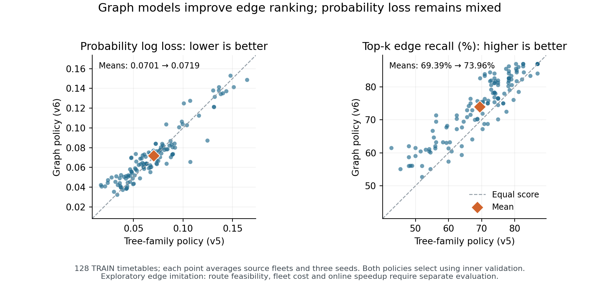

# First graph-model comparison on 128 TRAIN timetables

The graph models recover more of the reference schedule's movements among their
highest-scored edges than the tree models. Their probability log loss is worse
than the strongest tree baselines. This is a useful ranking result, with a clear
limit: it has not yet produced a cheaper feasible fleet or reduced online solving.

| Model or fixed policy | Log loss ↓ | Average precision ↑ | Trip-count top-k recall ↑ |
|---|---:|---:|---:|
| MLP32, extended budget v4 | 0.084204 | 0.747740 | 0.673704 |
| Histogram boosting, v3 | 0.069894 | 0.824254 | 0.691360 |
| Histogram boosting, extended budget v4 | 0.070373 | 0.825155 | 0.696634 |
| XGBoost, v5 | 0.069417 | 0.828270 | 0.696686 |
| CatBoost, v5 | 0.069298 | 0.826484 | 0.697748 |
| Tree-family inner-selected policy, v5 | 0.070127 | 0.826256 | 0.693924 |
| Mean-message graph network, v6 | 0.073002 | 0.833817 | 0.733234 |
| Graph-attention network, v6 | 0.071866 | 0.843094 | 0.739890 |
| Graph inner-selected policy, v6 | 0.071888 | 0.842573 | 0.739570 |

These are equal-timetable outer-fold averages over the same 128 TRAIN timetables,
255 observed source fleets, and three seeds. Variants stay together; preprocessing
uses fit data and selection uses inner validation. The frozen graph policy selected
attention in 11 fold/seed tasks and mean pooling in one. Relative to the frozen
tree-family policy, graph top-k recall rises by **4.56 percentage points** and
average precision by 0.01632, while log loss increases by 0.00176. No outer score
changes the selection rule. The policies' fitted model menus and training costs
differ, so this is not a controlled attribution of every gain to message passing.

The predeclared original-32 subgroup has the same tradeoff. Its graph policy gives
log loss/AP/top-k of 0.072412/0.847223/0.742795, compared with
0.069523/0.832968/0.700314 for the tree-family policy. The
[replay JSON](ROUTE_GRAPH_V6_REPLAY.json) retains all paired timetable scores,
other declared baseline comparisons and the known missing source for timetable
10037. These repeated TRAIN comparisons remain exploratory; development and final
test timetables are still sealed.

Both graph arms completed all 300 epochs in every task. Selected epochs were
298–300 for mean pooling and 297–300 for attention; no arm hit a time cap or stopped
early. This motivates a separately declared training-budget study, but does not
show that more training will improve held-out performance. The models are small,
task-specific two-layer networks of about 18,000 parameters, not exact reproductions
of a published GraphSAGE or GAT implementation. They use the existing 17 edge
features and compatibility graph; explicit battery/SOC and charger-context inputs
remain a separate versioned improvement.

The [independent saved-state verifier](replay_route_graph_v6.py) replays both models
in all 12 tasks without fitting. It independently implements the CPU forward pass
and metric formulas, checks the complete movement order, fit-only transforms,
inner-selected weights and promotion, and reproduces fit/inner/outer outputs.
Maximum probability discrepancy is 2.66e-15 and maximum metric discrepancy is
1.71e-14; complete rankings and threshold decisions are unchanged. Local macOS ARM
torch 2.4.1/NumPy 1.26.4 is numerically compared with the frozen Linux x86 training
runtime. The locally different sklearn/joblib versions are not used for fitting,
prediction or metrics; this is not a claim of identical runtimes. All training
tasks passed their pinned native probes before loading data. An initial verifier
assumption about accounting row count failed; that output, original verifier and
all verification time are preserved, and the corrected parent/step association
passes with unchanged numerical tolerances. The [review](ROUTE_GRAPH_V6_RESULT_REVIEW.md)
covers this distinction and the result's scope.

Slurm records **10,335 allocated CPU-seconds (2.87 CPU-hours)**, all 12 tasks
completed, at most four running together, and about 531 MiB peak task memory.
Candidate fit/inner work sums to 9,790 seconds. Reported outer inference across
all 12 tasks totals 1.69 seconds for mean pooling and 1.76 seconds for attention;
those times exclude model loading, decoding, charging and verification and are
not an online speedup result. All 12,770 raw files, including epoch histories,
remain local/remote and have a lossless [Git backup](RESULT_MANIFEST_ROUTE_GRAPH_V6.json).

The next test is physical: apply the frozen tabular, tree-family and graph policies
to the same declared TRAIN timetables and compare their direct proposals and
repaired plans with cost-only decoding, retained sources, matched source charging,
and cold solving. Keep raw decoding, repair, charging and independent replay
separate. The earlier four-timetable pilot lost its apparent gains once source
charging was matched; the expanded comparison must retain that control. Edge
labels still describe observed feasible incumbents rather than optimal routes,
and a convex-hull certificate still does not certify a physical fleet optimum.
