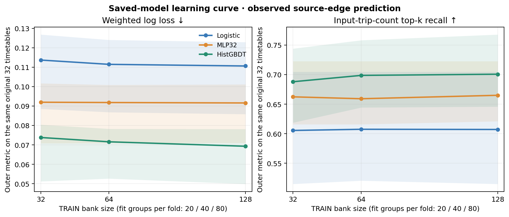

# Route-edge model: 128-group saved-model replay

All 12 grouped-fold/seed tasks from the exact 128-TRAIN-timetable prefix passed an independent saved-model replay under scikit-learn 1.7.2. The check reconstructed logistic, MLP32, and HistGBDT probabilities from saved coefficients/weights/joblib artifacts; verified fit-only preprocessing, outer edge keys/labels, source and timetable metrics, task/model/wrapper hashes; and matched the first four and eight admitted shard receipt/case/source hashes to the pinned 32- and 64-group pools. No model was fit or selected during replay. The registered censor at base 10037 leaves 255 observed feasible source fleets out of 256 intended, with that timetable still counted once at group level.

| Held-out edge metric, equal weight per timetable | Kind frequency | Logistic | MLP32 | HistGBDT |
|---|---:|---:|---:|---:|
| Weighted log loss ↓ | 0.20383 | 0.11071 | 0.09152 | **0.06989** |
| Weighted Brier ↓ | 0.05324 | 0.03112 | 0.02592 | **0.01968** |
| Average precision ↑ | 0.11035 | 0.66402 | 0.73005 | **0.82425** |
| Input-trip-count top-k recall ↑ | 0.13766 | 0.60366 | 0.65982 | **0.69136** |
| Positive recall at fixed 0.5 ↑ | 0 | 0.48032 | 0.60873 | **0.76623** |
| Negative recall at fixed 0.5 ↑ | 1.00000 | **0.99135** | 0.99018 | 0.98641 |

The fixed learning curve below evaluates the **same original 32 TRAIN timetables** at all three bank sizes. Each grouped fold uses 20/4/8 fit/inner/outer timetables in the 32-bank experiment, 40/8/16 in the 64-bank experiment, and 80/16/32 in the 128-bank experiment. The table's size labels refer to the total TRAIN bank, not the number fit or any use of outer data in fitting. Each timetable's observed sources are averaged, then its three seed evaluations; the 32 timetables receive equal weight. The shaded bands in the figure are the across-timetable interquartile range, not a confidence interval.

| Model, common-32 metric | Bank 32 | Bank 64 | Bank 128 | 128 vs 64 paired direction |
|---|---:|---:|---:|---|
| Logistic log loss ↓ | 0.11366 | 0.11145 | **0.11060** | 26/32 improve |
| Logistic average precision ↑ | 0.65543 | 0.65881 | **0.66085** | 21/32 improve |
| MLP32 log loss ↓ | 0.09195 | 0.09179 | **0.09157** | 18/32 improve |
| MLP32 average precision ↑ | 0.71975 | 0.71764 | **0.72263** | 19/32 improve |
| HistGBDT log loss ↓ | 0.07378 | 0.07157 | **0.06928** | 25/32 improve |
| HistGBDT average precision ↑ | 0.81523 | 0.82648 | **0.83256** | 17/32 improve |
| HistGBDT input-trip-count top-k recall ↑ | 0.68792 | 0.69867 | **0.70066** | 13 improve, 10 decline, 9 tie |

The most consistent gain is HistGBDT log loss: 128 vs 32 improves 26/32 paired timetables, with mean reduction 0.00450. Its common-32 average precision rises 0.01733 and top-k recall 0.01274 against the 32 fit, but those ranking gains are heterogeneous. MLP's common-32 log-loss reduction against the 32 fit is only 0.00038, and its outer ranking changes are small. Full-cohort 64 and 128 averages involve different held-out groups and should not be interpreted as a paired learning curve. Even the fixed common-32 comparison changes the inner/fit membership and the weighting of a censored source alongside sample size; it is a prospective learning-curve diagnostic, not a causal data-volume estimate.

Logistic reported no convergence warning in any task (138–275 LBFGS iterations). Every MLP selected and stopped at the fixed 300-epoch cap; all 12 saved inner curves were still falling at the last checkpoint. Mean selected inner-minus-fit log loss was −0.00410, although one fold's three seeds had a positive gap. This gives no evidence of inner-validation deterioration at the cap, but does not establish convergence or justify changing the cap using these outer outcomes. HistGBDT selected the maximum candidate, 200 trees, in all 12 tasks; its inner loss fell from the prior candidate in every task, while the selected mean inner-minus-fit gap was +0.00409. That modest fit/inner gap and the finite candidate grid warrant continued grouped validation, not an outer-tuned expansion.

These models predict membership of movements in *observed feasible source incumbents*, not which edges are globally optimal. A high edge score does not by itself assemble a legal fleet, pass charging replay, reduce the target bill, or accelerate the native solver. The trip-count ranking budget is known from the input case, rather than chosen from held-out positive labels. All work remains TRAIN-only; no development or reserved test timetable was used in fitting or checkpoint selection.

The versioned [strict replay](replay_route_model128.py) produced [ROUTE_MODEL128_REPLAY.json](ROUTE_MODEL128_REPLAY.json) under the separate local interpreter `tmp/sklearn172-replay-env/bin/python`, which matches the cluster training library versions. Run `PYTHONPATH=src LOKY_MAX_CPU_COUNT=1 tmp/sklearn172-replay-env/bin/python research-20260930/learning-campaign/replay_route_model128.py --validate-lineage-only` to recheck input lineage without modifying the immutable replay JSON. The [plotting script](plot_route_model32_to128.py) reads that JSON alone.
