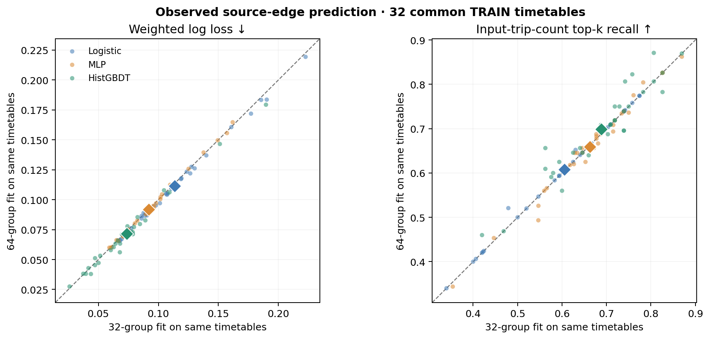

# Route-edge model: 64-group saved-model replay

The 12 completed 64-group tasks were replayed from their saved logistic coefficients, MLP weights, and scikit-learn 1.7.2 HistGradientBoosting artifacts. The replay checked the pinned 64-group pool, fit-only preprocessing, all outer edge keys/labels/probabilities, source-level metrics, timetable-level metrics, model hashes, and task/wrapper receipts. It performed **no fitting or model selection**. All 64 independent TRAIN timetables have at least one observed feasible source fleet; one registered source at base 10037 is censored, leaving 127 of 128 intended fleets. Each reported group metric averages its observed source fleets and then three seeds; the main aggregate weights timetables equally.

| Outer metric, equal timetable weight | Kind frequency | Logistic | MLP32 | HistGBDT |
|---|---:|---:|---:|---:|
| Weighted log loss ↓ | 0.20419 | 0.11124 | 0.09180 | **0.07101** |
| Weighted Brier ↓ | 0.05335 | 0.03106 | 0.02588 | **0.01985** |
| Average precision ↑ | 0.11060 | 0.66334 | 0.72621 | **0.82494** |
| Input-trip-count top-k recall ↑ | 0.13812 | 0.61043 | 0.66198 | **0.69554** |
| Positive recall at fixed 0.5 ↑ | 0 | 0.48369 | 0.62243 | **0.76872** |
| Negative recall at fixed 0.5 ↑ | 1.00000 | **0.99148** | 0.99003 | 0.98603 |

The nonlinear models classify the *movements used by observed feasible source incumbents* better than the fixed kind-frequency control. All three learned models improve log loss over that control on all 64 timetables. These scores do not establish a legal new route, a lower operating bill, or an optimal edge label. Top-k uses the timetable's input trip count as a prospective fixed budget; it does not use the held-out fleet's positive count to choose k.

The fixed 32→64 comparison evaluates the **same original 32 timetables** in both runs. Positive paired differences favor the 64-group fit. The other 32 timetables contribute only to the 64-group training/evaluation design, never to choosing a checkpoint from these outer scores.

| Model | Log loss, 32 → 64 fit ↓ | Paired log-loss gain (groups improved) | AP, 32 → 64 fit ↑ | Top-k, 32 → 64 fit ↑ |
|---|---:|---:|---:|---:|
| Logistic | 0.11366 → 0.11145 | 0.00221 (30/32) | 0.65543 → 0.65881 | 0.60553 → 0.60751 |
| MLP32 | 0.09195 → 0.09179 | 0.00015 (18/32) | 0.71975 → 0.71764 | 0.66239 → 0.65918 |
| HistGBDT | 0.07378 → 0.07157 | 0.00221 (23/32) | 0.81523 → 0.82648 | 0.68792 → 0.69867 |

For HistGBDT, AP improves on 22/32 groups and top-k recall on 14/32, declines on 10 and 6, and ties on 0 and 12 respectively. MLP's AP splits 16 improvements/16 declines, so the extra data did not yield a consistent MLP gain on this common cohort. The comparison is a fixed learning-curve diagnostic, not a randomized estimate of the effect of sample size: fit and inner groups, and the 64-run's handling of the one censored source, also differ. The matched points show the gains are modest and heterogeneous rather than a blanket improvement.

All 12 logistic fits reported no convergence warning and took 132–175 LBFGS iterations. Every MLP selected its 300-epoch cap; its saved inner log loss was still falling at the last checkpoint, with mean selected inner-minus-fit log loss −0.00689. This gives no evidence of inner-validation deterioration at the cap, while also not proving convergence. HistGBDT selected 200 trees in nine tasks and 100 in three. Its selected inner-minus-fit log-loss gap averaged +0.00677; in the three 100-tree cases the 200-tree inner score had flattened or risen despite continued fit improvement. The grouped inner sets made those selections; outer timetables did not.

Reproduce the saved-model check with `PYTHONPATH=src LOKY_MAX_CPU_COUNT=1 tmp/sklearn172-replay-env/bin/python research-20260930/learning-campaign/replay_route_model64.py` in a checkout where the immutable output JSON does not yet exist. The checked result is [ROUTE_MODEL64_REPLAY.json](ROUTE_MODEL64_REPLAY.json); [the plotting script](plot_route_model32_to64.py) uses that JSON only. The local replay environment was separate from the cluster training environment and matched its pinned scikit-learn/NumPy/SciPy versions.

Following independent review, the replay script additionally pins the prior 32-group replay SHA-256, its pooled-manifest SHA-256, and the first four admitted shard receipt/case/source table hashes against the 64-group pool. `--validate-lineage-only` passed on those archived inputs without regenerating or modifying the immutable replay JSON.
